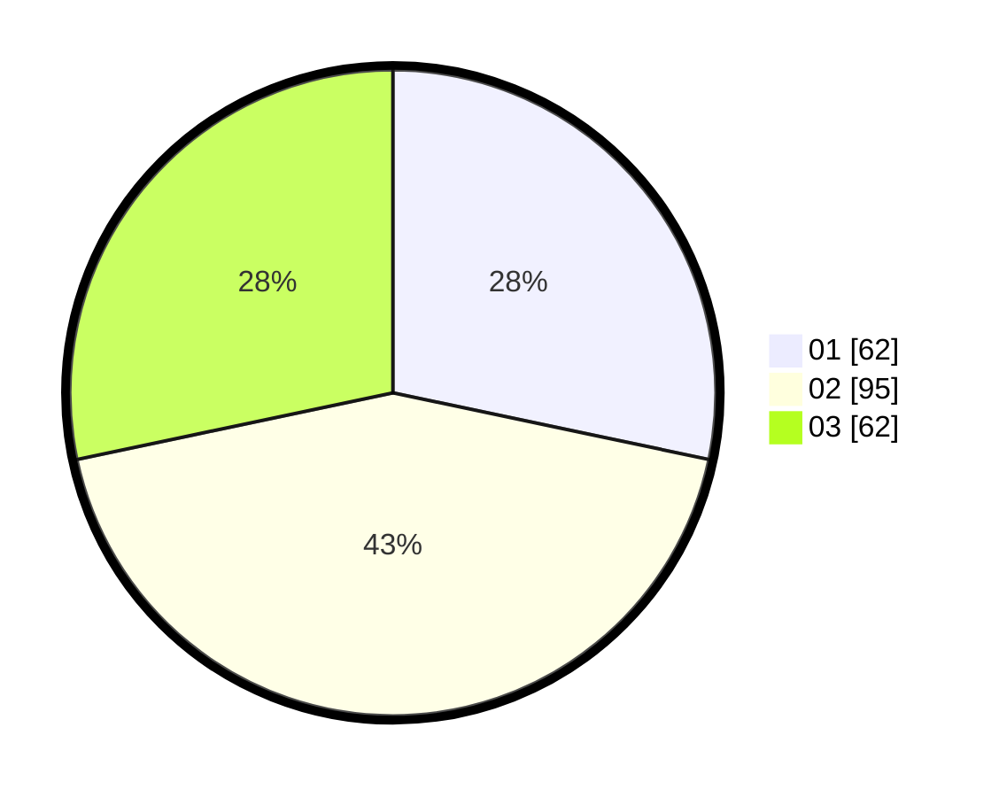

# Hasil

Hasil perolehan suara paslon dapat dilihat pada file paslon-01.txt, paslon-02.txt, dan paslon-03.txt.

Jika tidak ada, artinya data tersebut belum ada pada SIREKAP.

## Perolehan Suara

 * Paslon 01: **62**.
 * Paslon 02: **95**.
 * Paslon 03: **62**.

## Foto C Plano

https://sirekap-obj-formc.kpu.go.id/42ea/pemilu/ppwp/31/71/03/10/07/3171031007056-20240215-212754--4e4cf673-c1b9-4250-856e-7e5c73469e1b.jpg

https://sirekap-obj-formc.kpu.go.id/42ea/pemilu/ppwp/31/71/03/10/07/3171031007056-20240215-212756--9f3798ce-7760-4b1c-b8f7-78a2cb23c204.jpg

https://sirekap-obj-formc.kpu.go.id/42ea/pemilu/ppwp/31/71/03/10/07/3171031007056-20240215-212755--b2cf3ec5-0022-4a53-b3e5-f5f179507ed0.jpg

## DATA PEMILIH TETAP

Jumlah pemilih dalam DPT: **213**.
 * L: **98**.
 * P: **115**.

## DATA PENGGUNA HAK PILIH

Jumlah pengguna hak pilih dalam DPT: **213**.
 * L: **98**.
 * P: **115**.

Jumlah pengguna hak pilih dalam DPTb: **5**.
 * L: **2**.
 * P: **3**.

Jumlah pengguna hak pilih dalam DPK: **2**.
 * L: **0**.
 * P: **2**.

Jumlah pengguna hak pilih: **220**.
 * L: **100**.
 * P: **120**.

## JUMLAH SUARA SAH DAN TIDAK SAH

JUMLAH SELURUH SUARA SAH: **219**.

JUMLAH SUARA TIDAK SAH: **1**.

JUMLAH SELURUH SUARA SAH DAN SUARA TIDAK SAH: **220**.
