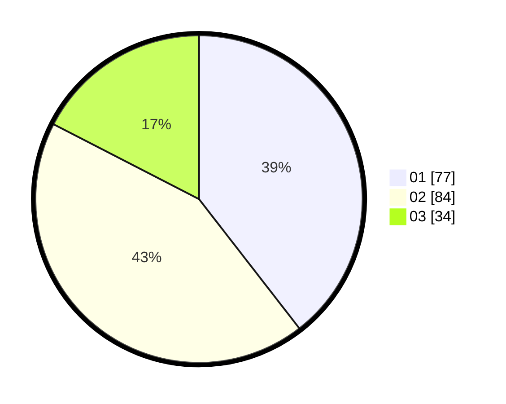

# Hasil

Hasil perolehan suara paslon dapat dilihat pada file paslon-01.txt, paslon-02.txt, dan paslon-03.txt.

Jika tidak ada, artinya data tersebut belum ada pada SIREKAP.

## Perolehan Suara

 * Paslon 01: **77**.
 * Paslon 02: **84**.
 * Paslon 03: **34**.

## Foto C Plano

https://sirekap-obj-formc.kpu.go.id/6644/pemilu/ppwp/31/71/03/10/07/3171031007061-20240216-120516--497f033e-584b-4995-9d42-9622d3064dfa.jpg

https://sirekap-obj-formc.kpu.go.id/6644/pemilu/ppwp/31/71/03/10/07/3171031007061-20240216-120518--82f08477-dfa7-42b9-9f39-959b0d6c6ae7.jpg

https://sirekap-obj-formc.kpu.go.id/6644/pemilu/ppwp/31/71/03/10/07/3171031007061-20240216-120517--fc79971b-a169-4467-bea8-fc81a7fb637f.jpg

## DATA PEMILIH TETAP

Jumlah pemilih dalam DPT: **258**.
 * L: **128**.
 * P: **130**.

## DATA PENGGUNA HAK PILIH

Jumlah pengguna hak pilih dalam DPT: **197**.
 * L: **94**.
 * P: **103**.

Jumlah pengguna hak pilih dalam DPTb: **0**.
 * L: **0**.
 * P: **0**.

Jumlah pengguna hak pilih dalam DPK: **0**.
 * L: **0**.
 * P: **0**.

Jumlah pengguna hak pilih: **197**.
 * L: **94**.
 * P: **103**.

## JUMLAH SUARA SAH DAN TIDAK SAH

JUMLAH SELURUH SUARA SAH: **195**.

JUMLAH SUARA TIDAK SAH: **2**.

JUMLAH SELURUH SUARA SAH DAN SUARA TIDAK SAH: **197**.
