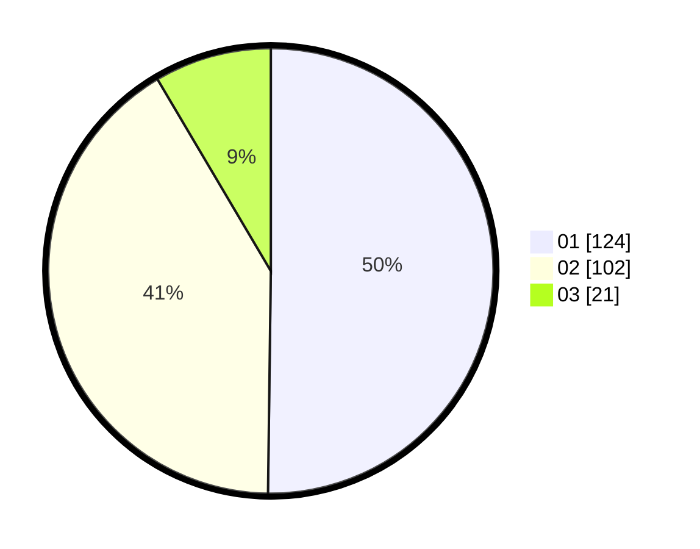

# Hasil

Hasil perolehan suara paslon dapat dilihat pada file paslon-01.txt, paslon-02.txt, dan paslon-03.txt.

Jika tidak ada, artinya data tersebut belum ada pada SIREKAP.

## Perolehan Suara

 * Paslon 01: **124**.
 * Paslon 02: **102**.
 * Paslon 03: **21**.

## Foto C Plano

https://sirekap-obj-formc.kpu.go.id/37b5/pemilu/ppwp/31/71/03/10/07/3171031007064-20240214-213739--b900e105-cb2d-426c-8822-bd4a3f96e520.jpg

https://sirekap-obj-formc.kpu.go.id/37b5/pemilu/ppwp/31/71/03/10/07/3171031007064-20240214-194753--7c2c7161-b7e5-4c07-9dfe-8a3f54937dc4.jpg

https://sirekap-obj-formc.kpu.go.id/37b5/pemilu/ppwp/31/71/03/10/07/3171031007064-20240214-194835--8e1b619a-855f-473e-afc6-b31d7cec4017.jpg
