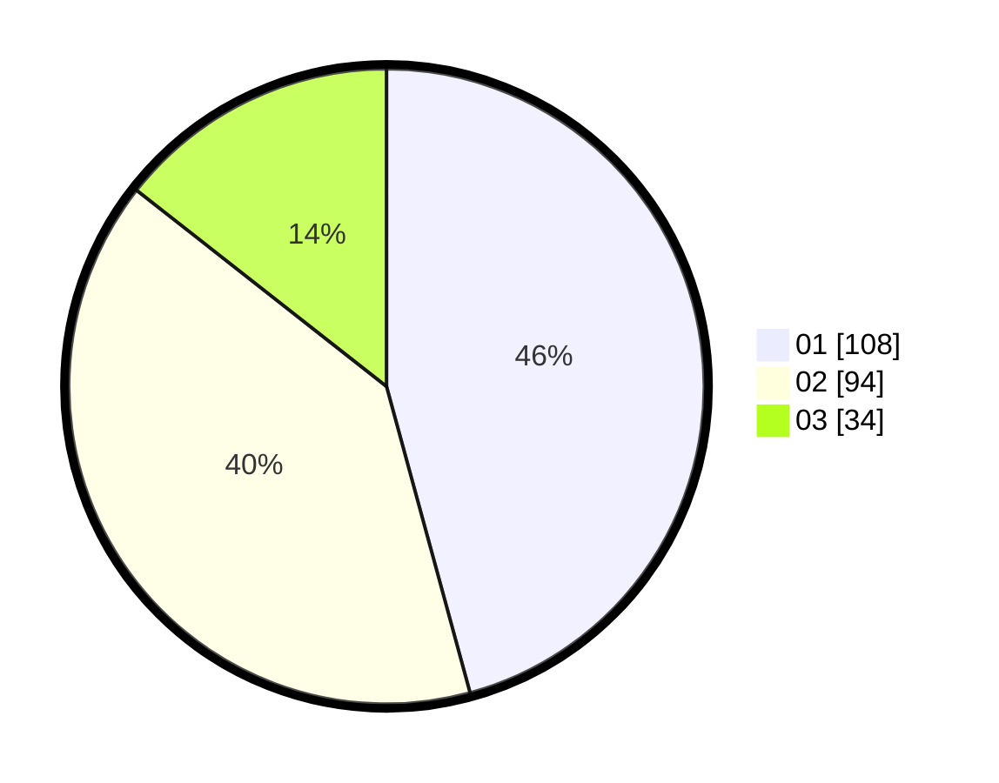

# Hasil

Hasil perolehan suara paslon dapat dilihat pada file paslon-01.txt, paslon-02.txt, dan paslon-03.txt.

Jika tidak ada, artinya data tersebut belum ada pada SIREKAP.

## Perolehan Suara

 * Paslon 01: **108**.
 * Paslon 02: **94**.
 * Paslon 03: **34**.

## Foto C Plano

https://sirekap-obj-formc.kpu.go.id/1eac/pemilu/ppwp/31/71/03/10/07/3171031007066-20240215-215216--c137a99d-761a-4da7-8b9f-025e37f29615.jpg

https://sirekap-obj-formc.kpu.go.id/1eac/pemilu/ppwp/31/71/03/10/07/3171031007066-20240215-215218--c0c01cd1-9462-465a-a85f-629c84eeba80.jpg

https://sirekap-obj-formc.kpu.go.id/1eac/pemilu/ppwp/31/71/03/10/07/3171031007066-20240215-215217--f16ebb64-d001-4f2e-848f-8b140f4cf545.jpg

## DATA PEMILIH TETAP

Jumlah pemilih dalam DPT: **294**.
 * L: **148**.
 * P: **146**.

## DATA PENGGUNA HAK PILIH

Jumlah pengguna hak pilih dalam DPT: **228**.
 * L: **113**.
 * P: **115**.

Jumlah pengguna hak pilih dalam DPTb: **13**.
 * L: **1**.
 * P: **12**.

Jumlah pengguna hak pilih dalam DPK: **0**.
 * L: **0**.
 * P: **0**.

Jumlah pengguna hak pilih: **241**.
 * L: **114**.
 * P: **127**.

## JUMLAH SUARA SAH DAN TIDAK SAH

JUMLAH SELURUH SUARA SAH: **236**.

JUMLAH SUARA TIDAK SAH: **5**.

JUMLAH SELURUH SUARA SAH DAN SUARA TIDAK SAH: **241**.
