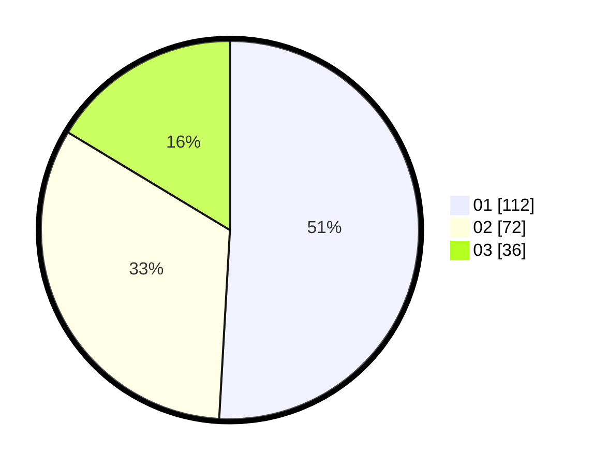

# Hasil

Hasil perolehan suara paslon dapat dilihat pada file paslon-01.txt, paslon-02.txt, dan paslon-03.txt.

Jika tidak ada, artinya data tersebut belum ada pada SIREKAP.

## Perolehan Suara

 * Paslon 01: **112**.
 * Paslon 02: **72**.
 * Paslon 03: **36**.

## Foto C Plano

https://sirekap-obj-formc.kpu.go.id/40f6/pemilu/ppwp/31/71/03/10/07/3171031007071-20240216-140410--c602cc4c-f4ae-4f1b-b53c-01b4ccc71d1e.jpg

https://sirekap-obj-formc.kpu.go.id/40f6/pemilu/ppwp/31/71/03/10/07/3171031007071-20240216-140412--d665765b-86de-4ef2-8b03-5ae1c9c27af4.jpg

https://sirekap-obj-formc.kpu.go.id/40f6/pemilu/ppwp/31/71/03/10/07/3171031007071-20240216-140411--550bc950-2882-4867-80b3-66e185b0ed98.jpg

## DATA PEMILIH TETAP

Jumlah pemilih dalam DPT: **271**.
 * L: **138**.
 * P: **133**.

## DATA PENGGUNA HAK PILIH

Jumlah pengguna hak pilih dalam DPT: **211**.
 * L: **105**.
 * P: **106**.

Jumlah pengguna hak pilih dalam DPTb: **1**.
 * L: **0**.
 * P: **1**.

Jumlah pengguna hak pilih dalam DPK: **8**.
 * L: **3**.
 * P: **5**.

Jumlah pengguna hak pilih: **220**.
 * L: **108**.
 * P: **112**.

## JUMLAH SUARA SAH DAN TIDAK SAH

JUMLAH SELURUH SUARA SAH: **220**.

JUMLAH SUARA TIDAK SAH: **0**.

JUMLAH SELURUH SUARA SAH DAN SUARA TIDAK SAH: **220**.
