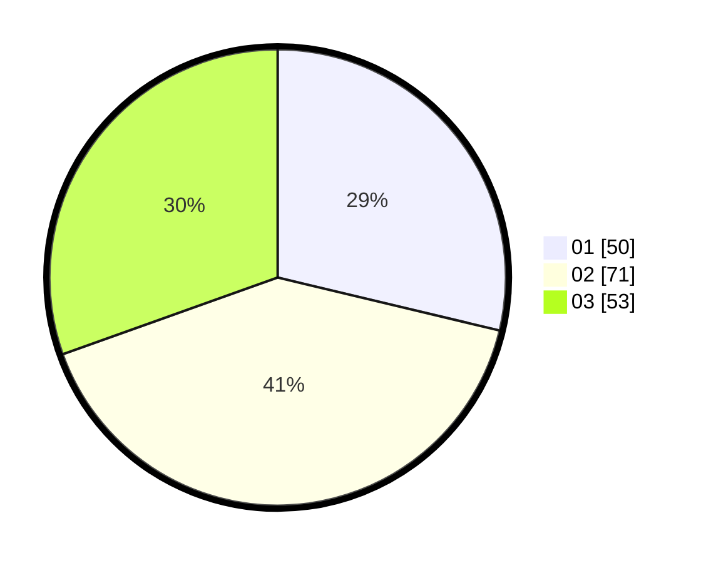

# Hasil

Hasil perolehan suara paslon dapat dilihat pada file paslon-01.txt, paslon-02.txt, dan paslon-03.txt.

Jika tidak ada, artinya data tersebut belum ada pada SIREKAP.

## Perolehan Suara

 * Paslon 01: **50**.
 * Paslon 02: **71**.
 * Paslon 03: **53**.

## Foto C Plano

https://sirekap-obj-formc.kpu.go.id/4c50/pemilu/ppwp/31/71/03/10/07/3171031007074-20240215-025608--faf1e987-8ecd-4de7-b1ca-5937bb1134f2.jpg

https://sirekap-obj-formc.kpu.go.id/4c50/pemilu/ppwp/31/71/03/10/07/3171031007074-20240215-025801--692b8482-33a8-45f7-a437-880db3fb30e3.jpg

https://sirekap-obj-formc.kpu.go.id/4c50/pemilu/ppwp/31/71/03/10/07/3171031007074-20240215-025923--5aa5b2a1-f199-4ebb-93a7-3557784e3eca.jpg

## DATA PEMILIH TETAP

Jumlah pemilih dalam DPT: **251**.
 * L: **129**.
 * P: **122**.

## DATA PENGGUNA HAK PILIH

Jumlah pengguna hak pilih dalam DPT: **168**.
 * L: **92**.
 * P: **76**.

Jumlah pengguna hak pilih dalam DPTb: **6**.
 * L: **2**.
 * P: **4**.

Jumlah pengguna hak pilih dalam DPK: **2**.
 * L: **1**.
 * P: **1**.

Jumlah pengguna hak pilih: **176**.
 * L: **95**.
 * P: **81**.

## JUMLAH SUARA SAH DAN TIDAK SAH

JUMLAH SELURUH SUARA SAH: **174**.

JUMLAH SUARA TIDAK SAH: **3**.

JUMLAH SELURUH SUARA SAH DAN SUARA TIDAK SAH: **177**.
