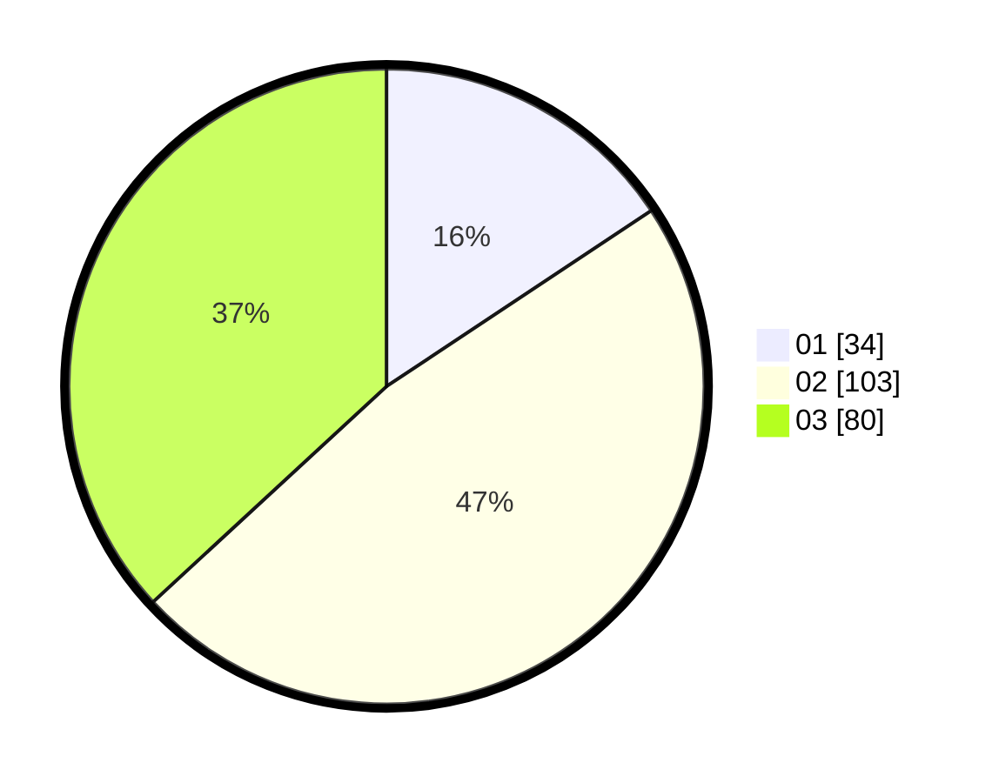

# Hasil

Hasil perolehan suara paslon dapat dilihat pada file paslon-01.txt, paslon-02.txt, dan paslon-03.txt.

Jika tidak ada, artinya data tersebut belum ada pada SIREKAP.

## Perolehan Suara

 * Paslon 01: **34**.
 * Paslon 02: **103**.
 * Paslon 03: **80**.

## Foto C Plano

https://sirekap-obj-formc.kpu.go.id/987f/pemilu/ppwp/31/71/03/10/07/3171031007075-20240215-181526--5ccf6607-ed68-4d33-a708-4045c7f3932f.jpg

https://sirekap-obj-formc.kpu.go.id/987f/pemilu/ppwp/31/71/03/10/07/3171031007075-20240215-181550--cff9dee4-a6cd-4c98-8055-ec80aa81bc3b.jpg

https://sirekap-obj-formc.kpu.go.id/987f/pemilu/ppwp/31/71/03/10/07/3171031007075-20240215-181536--e6cfcb27-b81a-43c2-9ebd-2be9b146a50f.jpg

## DATA PEMILIH TETAP

Jumlah pemilih dalam DPT: **292**.
 * L: **134**.
 * P: **158**.

## DATA PENGGUNA HAK PILIH

Jumlah pengguna hak pilih dalam DPT: **199**.
 * L: **91**.
 * P: **108**.

Jumlah pengguna hak pilih dalam DPTb: **13**.
 * L: **4**.
 * P: **9**.

Jumlah pengguna hak pilih dalam DPK: **7**.
 * L: **5**.
 * P: **2**.

Jumlah pengguna hak pilih: **219**.
 * L: **100**.
 * P: **119**.

## JUMLAH SUARA SAH DAN TIDAK SAH

JUMLAH SELURUH SUARA SAH: **218**.

JUMLAH SUARA TIDAK SAH: **1**.

JUMLAH SELURUH SUARA SAH DAN SUARA TIDAK SAH: **219**.
