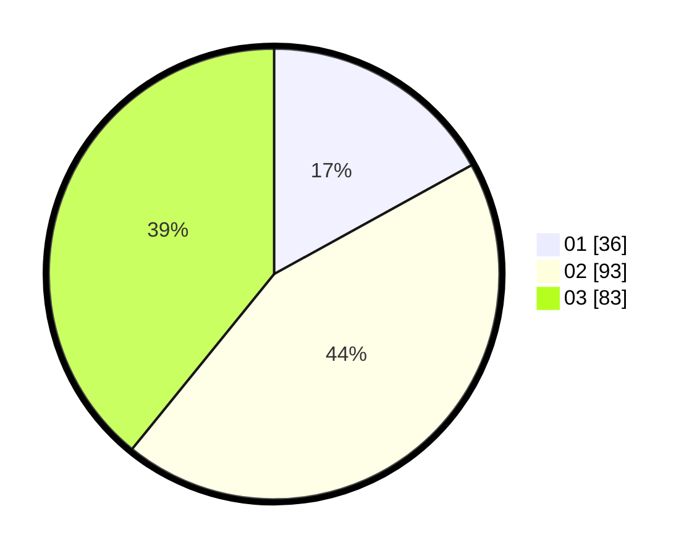

# Hasil

Hasil perolehan suara paslon dapat dilihat pada file paslon-01.txt, paslon-02.txt, dan paslon-03.txt.

Jika tidak ada, artinya data tersebut belum ada pada SIREKAP.

## Perolehan Suara

 * Paslon 01: **36**.
 * Paslon 02: **93**.
 * Paslon 03: **83**.

## Foto C Plano

https://sirekap-obj-formc.kpu.go.id/7b87/pemilu/ppwp/31/71/03/10/07/3171031007077-20240216-123717--b5625c65-d4b8-4d7e-b909-4ced8ffa48e4.jpg

https://sirekap-obj-formc.kpu.go.id/7b87/pemilu/ppwp/31/71/03/10/07/3171031007077-20240216-123719--43ad2141-9211-4009-829a-f3dfa62936f2.jpg

https://sirekap-obj-formc.kpu.go.id/7b87/pemilu/ppwp/31/71/03/10/07/3171031007077-20240216-123718--5b222d4c-c186-4118-9334-83054cb1b58c.jpg

## DATA PEMILIH TETAP

Jumlah pemilih dalam DPT: **291**.
 * L: **126**.
 * P: **165**.

## DATA PENGGUNA HAK PILIH

Jumlah pengguna hak pilih dalam DPT: **197**.
 * L: **87**.
 * P: **110**.

Jumlah pengguna hak pilih dalam DPTb: **11**.
 * L: **2**.
 * P: **9**.

Jumlah pengguna hak pilih dalam DPK: **6**.
 * L: **4**.
 * P: **2**.

Jumlah pengguna hak pilih: **214**.
 * L: **93**.
 * P: **121**.

## JUMLAH SUARA SAH DAN TIDAK SAH

JUMLAH SELURUH SUARA SAH: **212**.

JUMLAH SUARA TIDAK SAH: **2**.

JUMLAH SELURUH SUARA SAH DAN SUARA TIDAK SAH: **214**.
