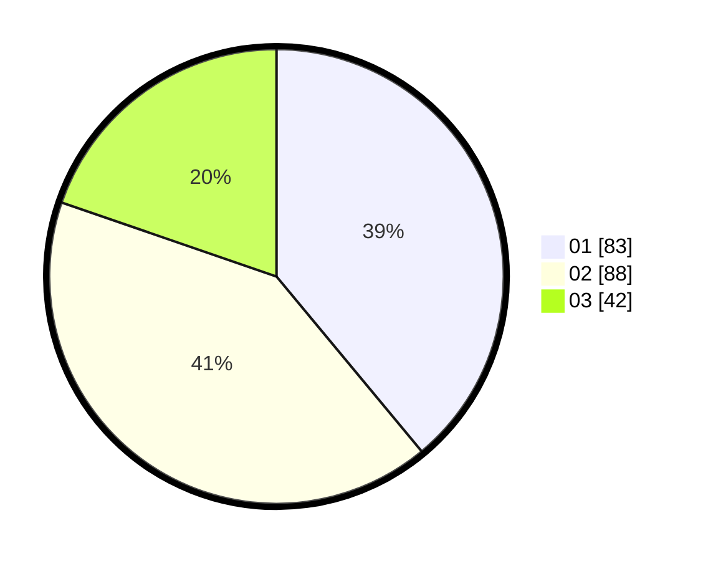

# Hasil

Hasil perolehan suara paslon dapat dilihat pada file paslon-01.txt, paslon-02.txt, dan paslon-03.txt.

Jika tidak ada, artinya data tersebut belum ada pada SIREKAP.

## Perolehan Suara

 * Paslon 01: **83**.
 * Paslon 02: **88**.
 * Paslon 03: **42**.

## Foto C Plano

https://sirekap-obj-formc.kpu.go.id/01a2/pemilu/ppwp/31/71/03/10/08/3171031008014-20240214-204038--06ac5ac3-8aa1-443b-9196-832dfc873080.jpg

https://sirekap-obj-formc.kpu.go.id/01a2/pemilu/ppwp/31/71/03/10/08/3171031008014-20240216-123730--14dad556-bf3b-401a-9974-8fd9e8725321.jpg

https://sirekap-obj-formc.kpu.go.id/01a2/pemilu/ppwp/31/71/03/10/08/3171031008014-20240214-204257--d94e7f9c-8ff9-4970-9237-82b1ee4a89d4.jpg

## DATA PEMILIH TETAP

Jumlah pemilih dalam DPT: **274**.
 * L: **131**.
 * P: **143**.

## DATA PENGGUNA HAK PILIH

Jumlah pengguna hak pilih dalam DPT: **209**.
 * L: **90**.
 * P: **119**.

Jumlah pengguna hak pilih dalam DPTb: **2**.
 * L: **2**.
 * P: **0**.

Jumlah pengguna hak pilih dalam DPK: **6**.
 * L: **2**.
 * P: **4**.

Jumlah pengguna hak pilih: **217**.
 * L: **94**.
 * P: **123**.

## JUMLAH SUARA SAH DAN TIDAK SAH

JUMLAH SELURUH SUARA SAH: **213**.

JUMLAH SUARA TIDAK SAH: **4**.

JUMLAH SELURUH SUARA SAH DAN SUARA TIDAK SAH: **217**.
