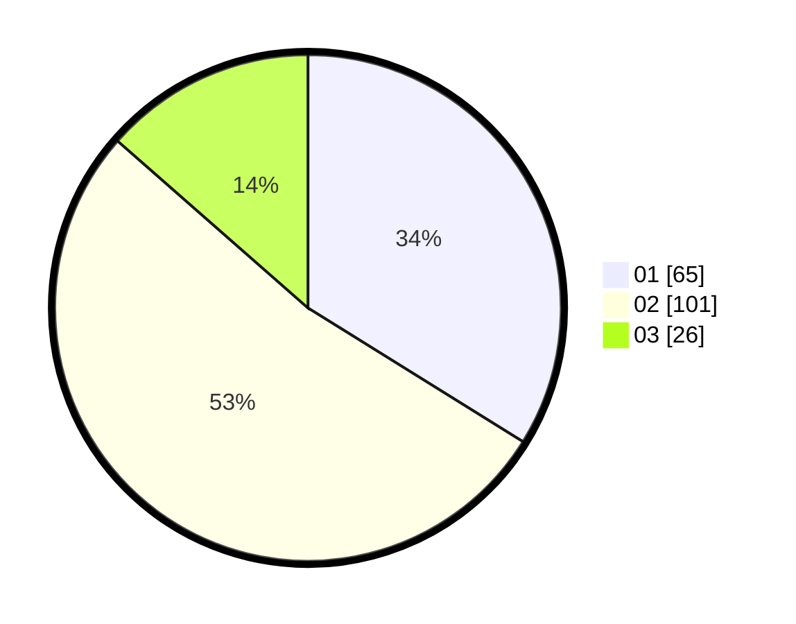

# Hasil

Hasil perolehan suara paslon dapat dilihat pada file paslon-01.txt, paslon-02.txt, dan paslon-03.txt.

Jika tidak ada, artinya data tersebut belum ada pada SIREKAP.

## Perolehan Suara

 * Paslon 01: **65**.
 * Paslon 02: **101**.
 * Paslon 03: **26**.

## Foto C Plano

https://sirekap-obj-formc.kpu.go.id/0703/pemilu/ppwp/31/71/03/10/08/3171031008016-20240215-213855--5391eafd-1ed3-418b-83fc-a82ba752f69b.jpg

https://sirekap-obj-formc.kpu.go.id/0703/pemilu/ppwp/31/71/03/10/08/3171031008016-20240215-213856--320d5a3c-28a4-4a3a-879e-8be76b3e7c4f.jpg

https://sirekap-obj-formc.kpu.go.id/0703/pemilu/ppwp/31/71/03/10/08/3171031008016-20240215-213855--8dd4ec05-5dfd-4544-885f-47600d246c2a.jpg

## DATA PEMILIH TETAP

Jumlah pemilih dalam DPT: **268**.
 * L: **137**.
 * P: **131**.

## DATA PENGGUNA HAK PILIH

Jumlah pengguna hak pilih dalam DPT: **189**.
 * L: **92**.
 * P: **97**.

Jumlah pengguna hak pilih dalam DPTb: **2**.
 * L: **1**.
 * P: **1**.

Jumlah pengguna hak pilih dalam DPK: **3**.
 * L: **2**.
 * P: **1**.

Jumlah pengguna hak pilih: **194**.
 * L: **95**.
 * P: **99**.

## JUMLAH SUARA SAH DAN TIDAK SAH

JUMLAH SELURUH SUARA SAH: **192**.

JUMLAH SUARA TIDAK SAH: **2**.

JUMLAH SELURUH SUARA SAH DAN SUARA TIDAK SAH: **194**.
