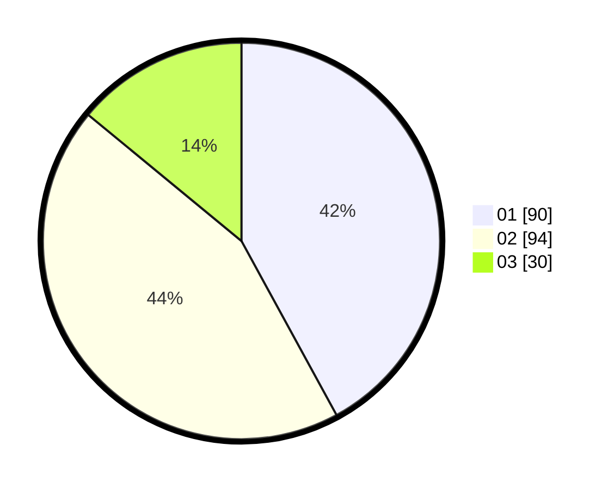

# Hasil

Hasil perolehan suara paslon dapat dilihat pada file paslon-01.txt, paslon-02.txt, dan paslon-03.txt.

Jika tidak ada, artinya data tersebut belum ada pada SIREKAP.

## Perolehan Suara

 * Paslon 01: **90**.
 * Paslon 02: **94**.
 * Paslon 03: **30**.

## Foto C Plano

https://sirekap-obj-formc.kpu.go.id/dce2/pemilu/ppwp/31/71/03/10/08/3171031008024-20240214-224119--764cc88a-d029-47b4-8268-004b372c761d.jpg

https://sirekap-obj-formc.kpu.go.id/dce2/pemilu/ppwp/31/71/03/10/08/3171031008024-20240214-224120--a9b2c114-b204-4466-a8d0-7086e3b24d37.jpg

https://sirekap-obj-formc.kpu.go.id/dce2/pemilu/ppwp/31/71/03/10/08/3171031008024-20240214-224119--e9f2e6e4-1f4f-4962-935d-69ff97a2d7f3.jpg

## DATA PEMILIH TETAP

Jumlah pemilih dalam DPT: **285**.
 * L: **135**.
 * P: **150**.

## DATA PENGGUNA HAK PILIH

Jumlah pengguna hak pilih dalam DPT: **211**.
 * L: **96**.
 * P: **115**.

Jumlah pengguna hak pilih dalam DPTb: **7**.
 * L: **2**.
 * P: **5**.

Jumlah pengguna hak pilih dalam DPK: **0**.
 * L: **0**.
 * P: **0**.

Jumlah pengguna hak pilih: **218**.
 * L: **98**.
 * P: **120**.

## JUMLAH SUARA SAH DAN TIDAK SAH

JUMLAH SELURUH SUARA SAH: **214**.

JUMLAH SUARA TIDAK SAH: **4**.

JUMLAH SELURUH SUARA SAH DAN SUARA TIDAK SAH: **218**.
