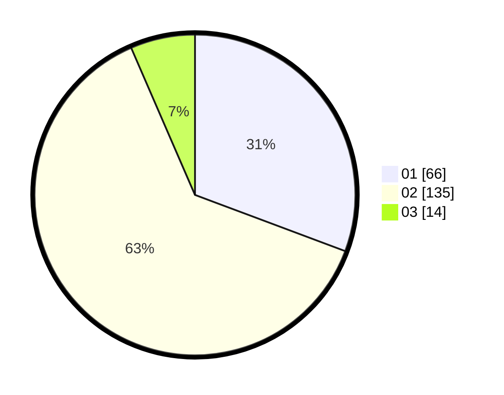

# Hasil

Hasil perolehan suara paslon dapat dilihat pada file paslon-01.txt, paslon-02.txt, dan paslon-03.txt.

Jika tidak ada, artinya data tersebut belum ada pada SIREKAP.

## Perolehan Suara

 * Paslon 01: **66**.
 * Paslon 02: **135**.
 * Paslon 03: **14**.

## Foto C Plano

https://sirekap-obj-formc.kpu.go.id/5b9f/pemilu/ppwp/31/71/03/10/08/3171031008025-20240214-220930--752106e4-4990-4ded-bba0-a66119baed5e.jpg

https://sirekap-obj-formc.kpu.go.id/5b9f/pemilu/ppwp/31/71/03/10/08/3171031008025-20240214-221040--8051c467-f4fd-438f-8b05-2339c6885af7.jpg

https://sirekap-obj-formc.kpu.go.id/5b9f/pemilu/ppwp/31/71/03/10/08/3171031008025-20240214-221132--d23b0a91-ea01-4c0f-ab97-54877fad563e.jpg

## DATA PEMILIH TETAP

Jumlah pemilih dalam DPT: **282**.
 * L: **145**.
 * P: **137**.

## DATA PENGGUNA HAK PILIH

Jumlah pengguna hak pilih dalam DPT: **216**.
 * L: **107**.
 * P: **109**.

Jumlah pengguna hak pilih dalam DPTb: **0**.
 * L: **0**.
 * P: **0**.

Jumlah pengguna hak pilih dalam DPK: **0**.
 * L: **0**.
 * P: **0**.

Jumlah pengguna hak pilih: **216**.
 * L: **107**.
 * P: **109**.

## JUMLAH SUARA SAH DAN TIDAK SAH

JUMLAH SELURUH SUARA SAH: **215**.

JUMLAH SUARA TIDAK SAH: **1**.

JUMLAH SELURUH SUARA SAH DAN SUARA TIDAK SAH: **216**.
