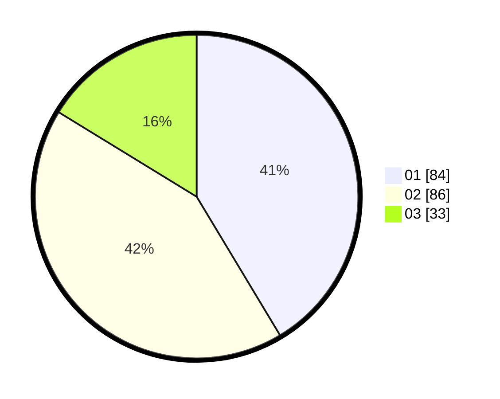

# Hasil

Hasil perolehan suara paslon dapat dilihat pada file paslon-01.txt, paslon-02.txt, dan paslon-03.txt.

Jika tidak ada, artinya data tersebut belum ada pada SIREKAP.

## Perolehan Suara

 * Paslon 01: **84**.
 * Paslon 02: **86**.
 * Paslon 03: **33**.

## Foto C Plano

https://sirekap-obj-formc.kpu.go.id/2eea/pemilu/ppwp/31/71/03/10/08/3171031008030-20240214-223925--f4c5118b-88aa-4e6e-b30c-47d1035524f3.jpg

https://sirekap-obj-formc.kpu.go.id/2eea/pemilu/ppwp/31/71/03/10/08/3171031008030-20240214-224004--e6e04740-8db6-4d4b-9cc7-2e0f80c22fc6.jpg

https://sirekap-obj-formc.kpu.go.id/2eea/pemilu/ppwp/31/71/03/10/08/3171031008030-20240214-224116--c56ec45e-cc57-4587-966d-5259f3217919.jpg

## DATA PEMILIH TETAP

Jumlah pemilih dalam DPT: **283**.
 * L: **150**.
 * P: **133**.

## DATA PENGGUNA HAK PILIH

Jumlah pengguna hak pilih dalam DPT: **204**.
 * L: **99**.
 * P: **105**.

Jumlah pengguna hak pilih dalam DPTb: **5**.
 * L: **0**.
 * P: **5**.

Jumlah pengguna hak pilih dalam DPK: **1**.
 * L: **1**.
 * P: **0**.

Jumlah pengguna hak pilih: **210**.
 * L: **100**.
 * P: **110**.

## JUMLAH SUARA SAH DAN TIDAK SAH

JUMLAH SELURUH SUARA SAH: **203**.

JUMLAH SUARA TIDAK SAH: **7**.

JUMLAH SELURUH SUARA SAH DAN SUARA TIDAK SAH: **210**.
