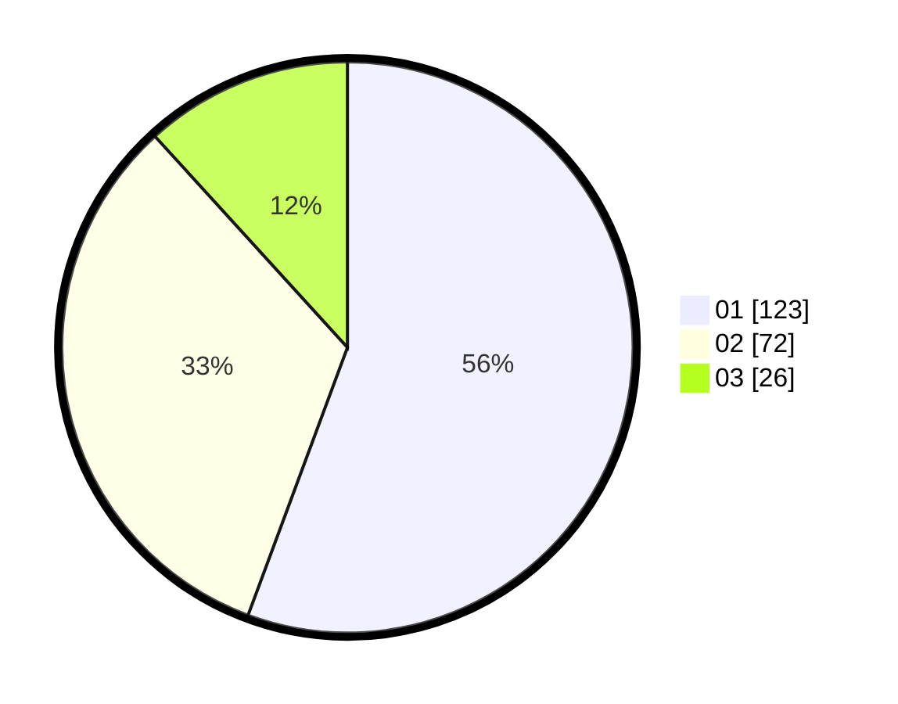

# Hasil

Hasil perolehan suara paslon dapat dilihat pada file paslon-01.txt, paslon-02.txt, dan paslon-03.txt.

Jika tidak ada, artinya data tersebut belum ada pada SIREKAP.

## Perolehan Suara

 * Paslon 01: **123**.
 * Paslon 02: **72**.
 * Paslon 03: **26**.

## Foto C Plano

https://sirekap-obj-formc.kpu.go.id/073c/pemilu/ppwp/31/71/03/10/08/3171031008031-20240216-115644--50fe0ead-ddf3-4916-96ce-20e26909e5b7.jpg

https://sirekap-obj-formc.kpu.go.id/073c/pemilu/ppwp/31/71/03/10/08/3171031008031-20240216-115650--62546935-48db-4311-a0fc-f6698b877db8.jpg

https://sirekap-obj-formc.kpu.go.id/073c/pemilu/ppwp/31/71/03/10/08/3171031008031-20240216-115647--58c53fa4-6b61-4da0-84ae-d2ce873e10ba.jpg

## DATA PEMILIH TETAP

Jumlah pemilih dalam DPT: **287**.
 * L: **149**.
 * P: **138**.

## DATA PENGGUNA HAK PILIH

Jumlah pengguna hak pilih dalam DPT: **222**.
 * L: **110**.
 * P: **112**.

Jumlah pengguna hak pilih dalam DPTb: **0**.
 * L: **0**.
 * P: **0**.

Jumlah pengguna hak pilih dalam DPK: **0**.
 * L: **0**.
 * P: **0**.

Jumlah pengguna hak pilih: **222**.
 * L: **110**.
 * P: **112**.

## JUMLAH SUARA SAH DAN TIDAK SAH

JUMLAH SELURUH SUARA SAH: **221**.

JUMLAH SUARA TIDAK SAH: **1**.

JUMLAH SELURUH SUARA SAH DAN SUARA TIDAK SAH: **222**.
