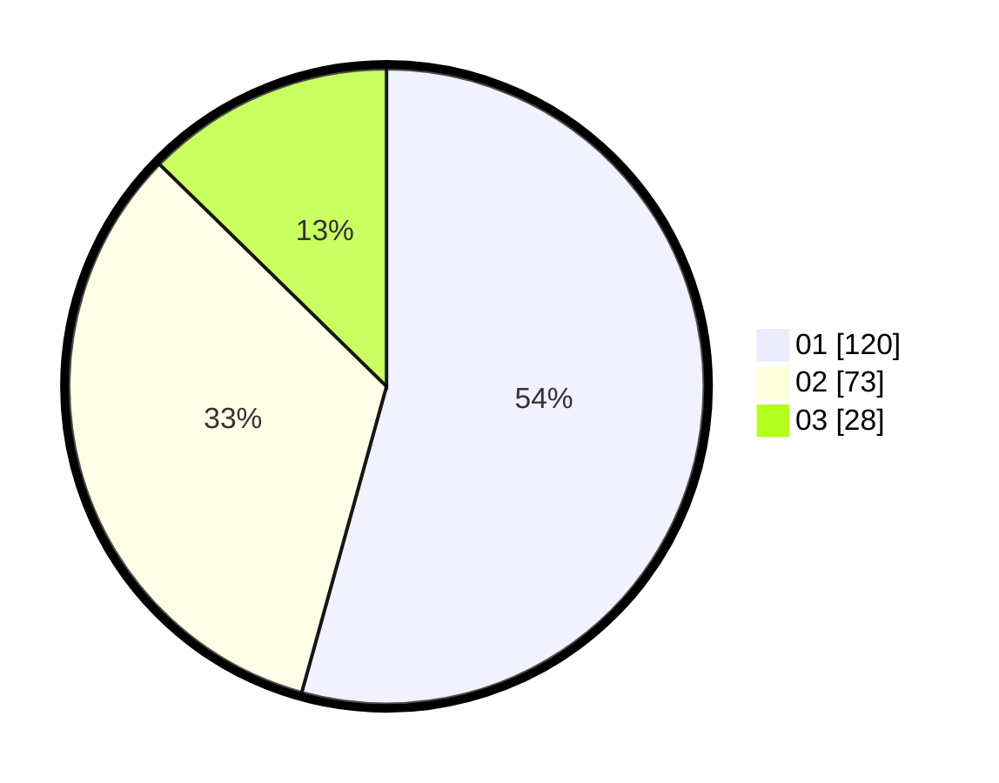

# Hasil

Hasil perolehan suara paslon dapat dilihat pada file paslon-01.txt, paslon-02.txt, dan paslon-03.txt.

Jika tidak ada, artinya data tersebut belum ada pada SIREKAP.

## Perolehan Suara

 * Paslon 01: **120**.
 * Paslon 02: **73**.
 * Paslon 03: **28**.

## Foto C Plano

https://sirekap-obj-formc.kpu.go.id/c7a1/pemilu/ppwp/31/71/03/10/08/3171031008034-20240216-120600--6bceb875-ec29-4bf4-94f6-e5868549ce75.jpg

https://sirekap-obj-formc.kpu.go.id/c7a1/pemilu/ppwp/31/71/03/10/08/3171031008034-20240214-203331--7f3aad17-161c-47f2-88cc-575a5219be62.jpg

https://sirekap-obj-formc.kpu.go.id/c7a1/pemilu/ppwp/31/71/03/10/08/3171031008034-20240214-194914--2ba79aa4-e52c-4f9a-a0ad-0275c6cf1511.jpg

## DATA PEMILIH TETAP

Jumlah pemilih dalam DPT: **289**.
 * L: **143**.
 * P: **146**.

## DATA PENGGUNA HAK PILIH

Jumlah pengguna hak pilih dalam DPT: **226**.
 * L: **104**.
 * P: **122**.

Jumlah pengguna hak pilih dalam DPTb: **1**.
 * L: **0**.
 * P: **1**.

Jumlah pengguna hak pilih dalam DPK: **0**.
 * L: **0**.
 * P: **0**.

Jumlah pengguna hak pilih: **227**.
 * L: **104**.
 * P: **123**.

## JUMLAH SUARA SAH DAN TIDAK SAH

JUMLAH SELURUH SUARA SAH: **221**.

JUMLAH SUARA TIDAK SAH: **6**.

JUMLAH SELURUH SUARA SAH DAN SUARA TIDAK SAH: **227**.
