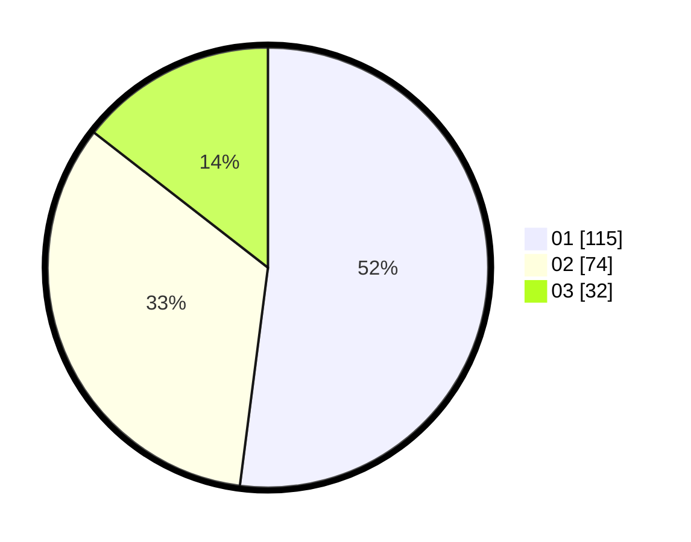

# Hasil

Hasil perolehan suara paslon dapat dilihat pada file paslon-01.txt, paslon-02.txt, dan paslon-03.txt.

Jika tidak ada, artinya data tersebut belum ada pada SIREKAP.

## Perolehan Suara

 * Paslon 01: **115**.
 * Paslon 02: **74**.
 * Paslon 03: **32**.

## Foto C Plano

https://sirekap-obj-formc.kpu.go.id/9e35/pemilu/ppwp/31/71/03/10/08/3171031008035-20240215-002642--4b3c703a-0c1d-4193-8285-ce8b5e4fc5df.jpg

https://sirekap-obj-formc.kpu.go.id/9e35/pemilu/ppwp/31/71/03/10/08/3171031008035-20240215-002753--c5985c01-7854-4b27-a35b-ae48dd2213c9.jpg

https://sirekap-obj-formc.kpu.go.id/9e35/pemilu/ppwp/31/71/03/10/08/3171031008035-20240215-002837--b55f615c-81f7-4662-93cb-5251a6d5a233.jpg

## DATA PEMILIH TETAP

Jumlah pemilih dalam DPT: **276**.
 * L: **135**.
 * P: **141**.

## DATA PENGGUNA HAK PILIH

Jumlah pengguna hak pilih dalam DPT: **221**.
 * L: **105**.
 * P: **116**.

Jumlah pengguna hak pilih dalam DPTb: **0**.
 * L: **0**.
 * P: **0**.

Jumlah pengguna hak pilih dalam DPK: **2**.
 * L: **1**.
 * P: **1**.

Jumlah pengguna hak pilih: **223**.
 * L: **106**.
 * P: **117**.

## JUMLAH SUARA SAH DAN TIDAK SAH

JUMLAH SELURUH SUARA SAH: **221**.

JUMLAH SUARA TIDAK SAH: **2**.

JUMLAH SELURUH SUARA SAH DAN SUARA TIDAK SAH: **223**.
