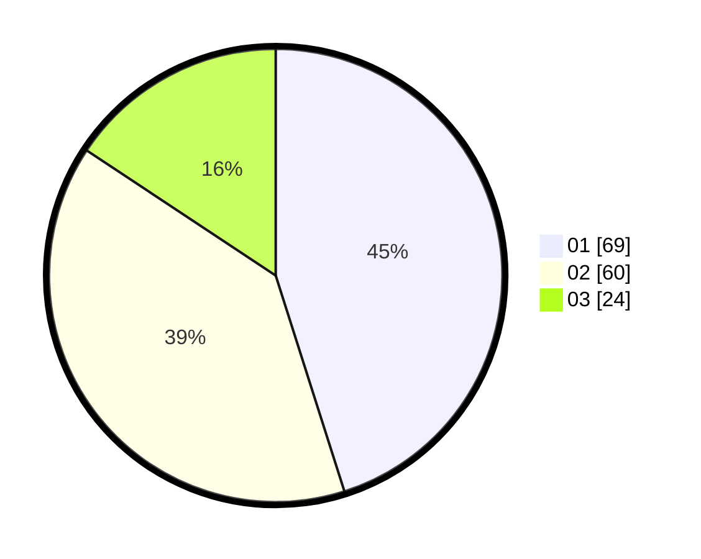

# Hasil

Hasil perolehan suara paslon dapat dilihat pada file paslon-01.txt, paslon-02.txt, dan paslon-03.txt.

Jika tidak ada, artinya data tersebut belum ada pada SIREKAP.

## Perolehan Suara

 * Paslon 01: **69**.
 * Paslon 02: **60**.
 * Paslon 03: **24**.

## Foto C Plano

https://sirekap-obj-formc.kpu.go.id/6339/pemilu/ppwp/31/71/03/10/08/3171031008036-20240215-213903--77a41e9a-1f1f-4fb1-bb2e-d7b3b2e993dd.jpg

https://sirekap-obj-formc.kpu.go.id/6339/pemilu/ppwp/31/71/03/10/08/3171031008036-20240215-213906--407a11fe-af82-4662-8bf5-c796df0c920f.jpg

https://sirekap-obj-formc.kpu.go.id/6339/pemilu/ppwp/31/71/03/10/08/3171031008036-20240215-213905--9d827a3f-58ac-43c1-bb91-b61fb74fbed1.jpg

## DATA PEMILIH TETAP

Jumlah pemilih dalam DPT: **227**.
 * L: **111**.
 * P: **116**.

## DATA PENGGUNA HAK PILIH

Jumlah pengguna hak pilih dalam DPT: **152**.
 * L: **73**.
 * P: **79**.

Jumlah pengguna hak pilih dalam DPTb: **0**.
 * L: **0**.
 * P: **0**.

Jumlah pengguna hak pilih dalam DPK: **4**.
 * L: **2**.
 * P: **2**.

Jumlah pengguna hak pilih: **156**.
 * L: **75**.
 * P: **81**.

## JUMLAH SUARA SAH DAN TIDAK SAH

JUMLAH SELURUH SUARA SAH: **153**.

JUMLAH SUARA TIDAK SAH: **3**.

JUMLAH SELURUH SUARA SAH DAN SUARA TIDAK SAH: **156**.
