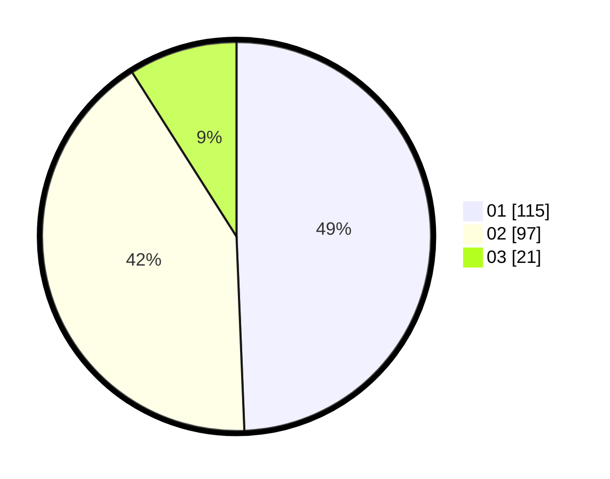

# Hasil

Hasil perolehan suara paslon dapat dilihat pada file paslon-01.txt, paslon-02.txt, dan paslon-03.txt.

Jika tidak ada, artinya data tersebut belum ada pada SIREKAP.

## Perolehan Suara

 * Paslon 01: **115**.
 * Paslon 02: **97**.
 * Paslon 03: **21**.

## Foto C Plano

https://sirekap-obj-formc.kpu.go.id/7e6e/pemilu/ppwp/31/71/03/10/08/3171031008037-20240216-125932--b2a863b4-4442-41e8-b943-90278e2dc80c.jpg

https://sirekap-obj-formc.kpu.go.id/7e6e/pemilu/ppwp/31/71/03/10/08/3171031008037-20240216-125933--a8cf05ce-276d-4a7e-9f56-7d86221f5ca1.jpg

https://sirekap-obj-formc.kpu.go.id/7e6e/pemilu/ppwp/31/71/03/10/08/3171031008037-20240216-125932--91382757-a83c-406a-a274-1c24ad4b1504.jpg

## DATA PEMILIH TETAP

Jumlah pemilih dalam DPT: **281**.
 * L: **144**.
 * P: **137**.

## DATA PENGGUNA HAK PILIH

Jumlah pengguna hak pilih dalam DPT: **235**.
 * L: **124**.
 * P: **111**.

Jumlah pengguna hak pilih dalam DPTb: **2**.
 * L: **1**.
 * P: **1**.

Jumlah pengguna hak pilih dalam DPK: **3**.
 * L: **2**.
 * P: **1**.

Jumlah pengguna hak pilih: **240**.
 * L: **127**.
 * P: **113**.

## JUMLAH SUARA SAH DAN TIDAK SAH

JUMLAH SELURUH SUARA SAH: **233**.

JUMLAH SUARA TIDAK SAH: **7**.

JUMLAH SELURUH SUARA SAH DAN SUARA TIDAK SAH: **240**.
