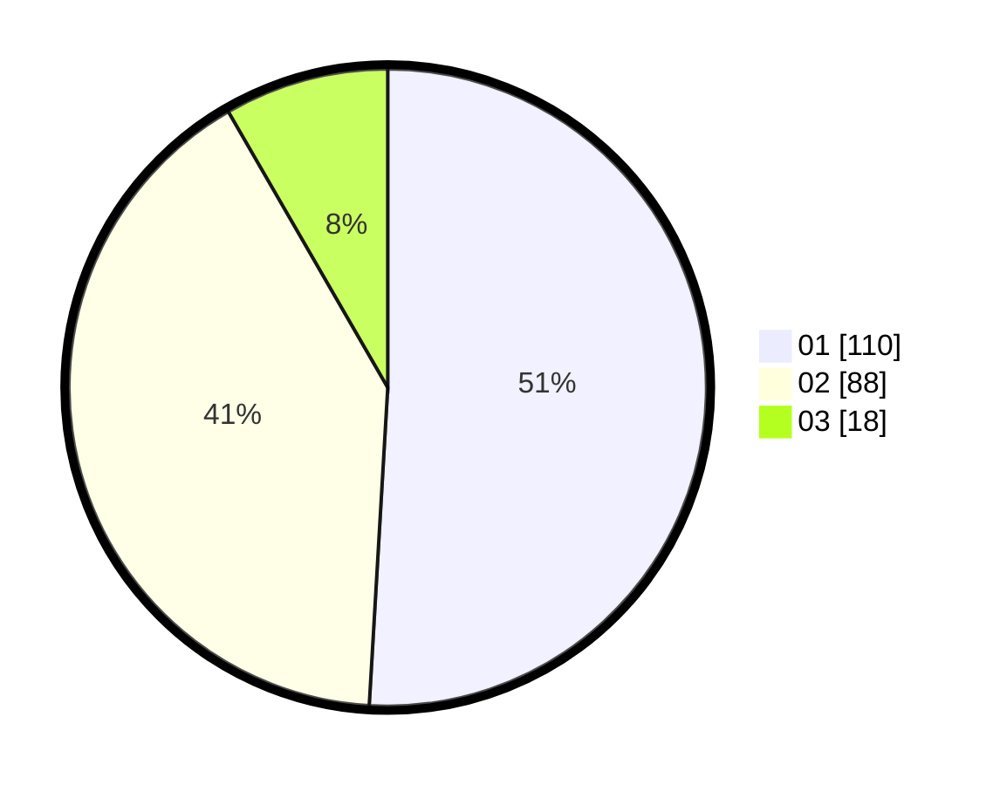

# Hasil

Hasil perolehan suara paslon dapat dilihat pada file paslon-01.txt, paslon-02.txt, dan paslon-03.txt.

Jika tidak ada, artinya data tersebut belum ada pada SIREKAP.

## Perolehan Suara

 * Paslon 01: **110**.
 * Paslon 02: **88**.
 * Paslon 03: **18**.

## Foto C Plano

https://sirekap-obj-formc.kpu.go.id/7198/pemilu/ppwp/31/71/03/10/08/3171031008039-20240214-222045--11b4dd2d-b899-49f9-9229-dd4b27be2d3f.jpg

https://sirekap-obj-formc.kpu.go.id/7198/pemilu/ppwp/31/71/03/10/08/3171031008039-20240214-222117--d28bf74a-42e3-4bc9-9365-45c926258107.jpg

https://sirekap-obj-formc.kpu.go.id/7198/pemilu/ppwp/31/71/03/10/08/3171031008039-20240214-222133--f9123293-db23-4656-85b1-12d94362e086.jpg

## DATA PEMILIH TETAP

Jumlah pemilih dalam DPT: **287**.
 * L: **137**.
 * P: **150**.

## DATA PENGGUNA HAK PILIH

Jumlah pengguna hak pilih dalam DPT: **223**.
 * L: **105**.
 * P: **118**.

Jumlah pengguna hak pilih dalam DPTb: **3**.
 * L: **1**.
 * P: **2**.

Jumlah pengguna hak pilih dalam DPK: **0**.
 * L: **0**.
 * P: **0**.

Jumlah pengguna hak pilih: **226**.
 * L: **106**.
 * P: **120**.

## JUMLAH SUARA SAH DAN TIDAK SAH

JUMLAH SELURUH SUARA SAH: **216**.

JUMLAH SUARA TIDAK SAH: **10**.

JUMLAH SELURUH SUARA SAH DAN SUARA TIDAK SAH: **226**.
