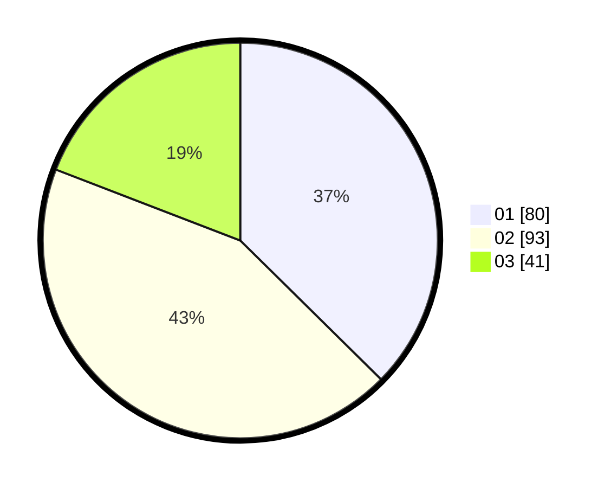

# Hasil

Hasil perolehan suara paslon dapat dilihat pada file paslon-01.txt, paslon-02.txt, dan paslon-03.txt.

Jika tidak ada, artinya data tersebut belum ada pada SIREKAP.

## Perolehan Suara

 * Paslon 01: **80**.
 * Paslon 02: **93**.
 * Paslon 03: **41**.

## Foto C Plano

https://sirekap-obj-formc.kpu.go.id/a0e2/pemilu/ppwp/31/71/03/10/08/3171031008043-20240214-155237--129550a1-578d-4631-b941-7284551718fe.jpg

https://sirekap-obj-formc.kpu.go.id/a0e2/pemilu/ppwp/31/71/03/10/08/3171031008043-20240214-162238--69f817d1-190e-4edc-8e56-4926fd08f069.jpg
