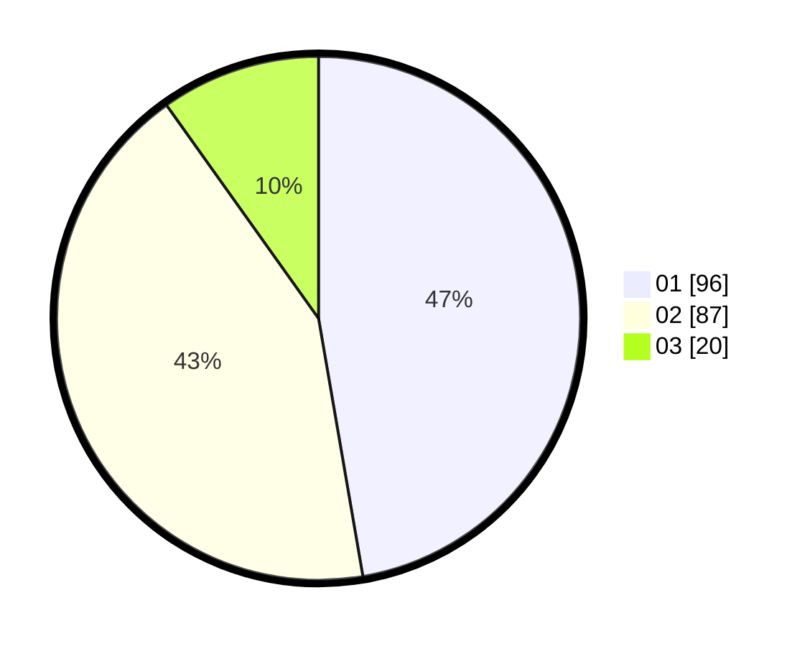

# Hasil

Hasil perolehan suara paslon dapat dilihat pada file paslon-01.txt, paslon-02.txt, dan paslon-03.txt.

Jika tidak ada, artinya data tersebut belum ada pada SIREKAP.

## Perolehan Suara

 * Paslon 01: **96**.
 * Paslon 02: **87**.
 * Paslon 03: **20**.

## Foto C Plano

https://sirekap-obj-formc.kpu.go.id/5e42/pemilu/ppwp/31/71/03/10/08/3171031008044-20240216-125849--cc201162-e3c5-4d74-b640-d5885fdd9edb.jpg

https://sirekap-obj-formc.kpu.go.id/5e42/pemilu/ppwp/31/71/03/10/08/3171031008044-20240216-125855--93060254-21e6-4146-9390-806e05836a65.jpg

https://sirekap-obj-formc.kpu.go.id/5e42/pemilu/ppwp/31/71/03/10/08/3171031008044-20240216-125851--0d85e86d-d850-439e-b45b-bfaf64f0f8c4.jpg

## DATA PEMILIH TETAP

Jumlah pemilih dalam DPT: **281**.
 * L: **148**.
 * P: **133**.

## DATA PENGGUNA HAK PILIH

Jumlah pengguna hak pilih dalam DPT: **197**.
 * L: **101**.
 * P: **96**.

Jumlah pengguna hak pilih dalam DPTb: **7**.
 * L: **3**.
 * P: **4**.

Jumlah pengguna hak pilih dalam DPK: **1**.
 * L: **1**.
 * P: **0**.

Jumlah pengguna hak pilih: **205**.
 * L: **105**.
 * P: **100**.

## JUMLAH SUARA SAH DAN TIDAK SAH

JUMLAH SELURUH SUARA SAH: **203**.

JUMLAH SUARA TIDAK SAH: **2**.

JUMLAH SELURUH SUARA SAH DAN SUARA TIDAK SAH: **205**.
