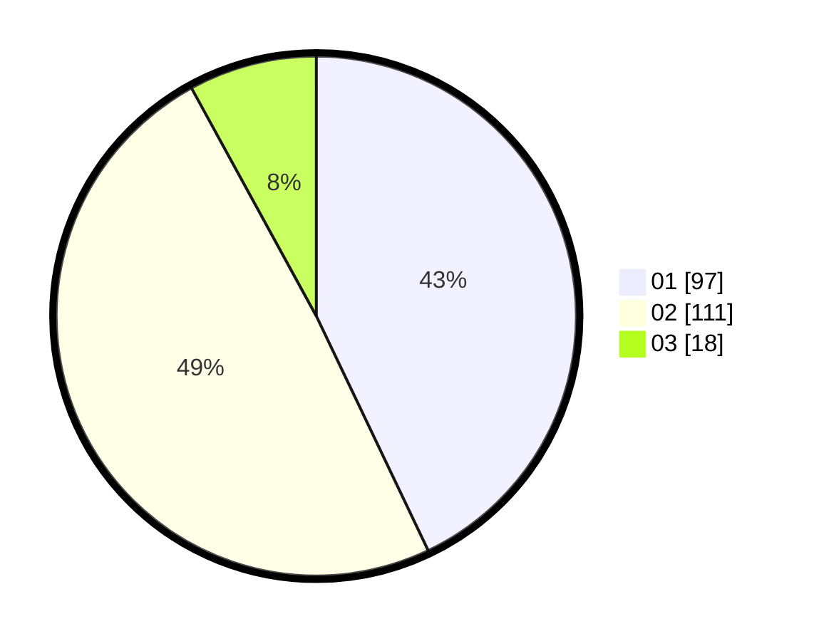

# Hasil

Hasil perolehan suara paslon dapat dilihat pada file paslon-01.txt, paslon-02.txt, dan paslon-03.txt.

Jika tidak ada, artinya data tersebut belum ada pada SIREKAP.

## Perolehan Suara

 * Paslon 01: **97**.
 * Paslon 02: **111**.
 * Paslon 03: **18**.

## Foto C Plano

https://sirekap-obj-formc.kpu.go.id/6eb0/pemilu/ppwp/31/71/03/10/08/3171031008046-20240216-102532--f4ff2589-16bc-4486-92c6-2774e8db97b1.jpg

https://sirekap-obj-formc.kpu.go.id/6eb0/pemilu/ppwp/31/71/03/10/08/3171031008046-20240216-102536--4a00ce22-5f21-41bf-8838-b8cd3eb50278.jpg

https://sirekap-obj-formc.kpu.go.id/6eb0/pemilu/ppwp/31/71/03/10/08/3171031008046-20240216-102534--f382b962-330f-4bc9-a931-4129fd4585d2.jpg

## DATA PEMILIH TETAP

Jumlah pemilih dalam DPT: **274**.
 * L: **141**.
 * P: **133**.

## DATA PENGGUNA HAK PILIH

Jumlah pengguna hak pilih dalam DPT: **220**.
 * L: **108**.
 * P: **112**.

Jumlah pengguna hak pilih dalam DPTb: **1**.
 * L: **1**.
 * P: **0**.

Jumlah pengguna hak pilih dalam DPK: **6**.
 * L: **2**.
 * P: **4**.

Jumlah pengguna hak pilih: **227**.
 * L: **111**.
 * P: **116**.

## JUMLAH SUARA SAH DAN TIDAK SAH

JUMLAH SELURUH SUARA SAH: **226**.

JUMLAH SUARA TIDAK SAH: **1**.

JUMLAH SELURUH SUARA SAH DAN SUARA TIDAK SAH: **227**.
