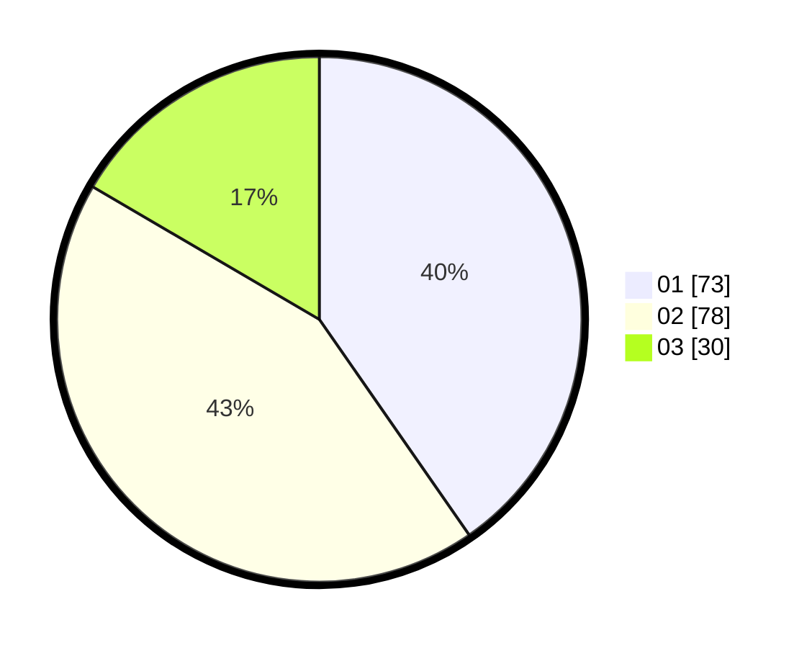

# Hasil

Hasil perolehan suara paslon dapat dilihat pada file paslon-01.txt, paslon-02.txt, dan paslon-03.txt.

Jika tidak ada, artinya data tersebut belum ada pada SIREKAP.

## Perolehan Suara

 * Paslon 01: **73**.
 * Paslon 02: **78**.
 * Paslon 03: **30**.

## Foto C Plano

https://sirekap-obj-formc.kpu.go.id/855f/pemilu/ppwp/31/71/03/10/08/3171031008048-20240214-223250--347bd1f7-9e3a-4b63-9167-5bffda044fa7.jpg

https://sirekap-obj-formc.kpu.go.id/855f/pemilu/ppwp/31/71/03/10/08/3171031008048-20240214-223402--6ff03656-7335-48c7-9d65-ff34a7c47d1c.jpg

https://sirekap-obj-formc.kpu.go.id/855f/pemilu/ppwp/31/71/03/10/08/3171031008048-20240214-223522--cfee510a-f117-454b-9270-b1c636508153.jpg
