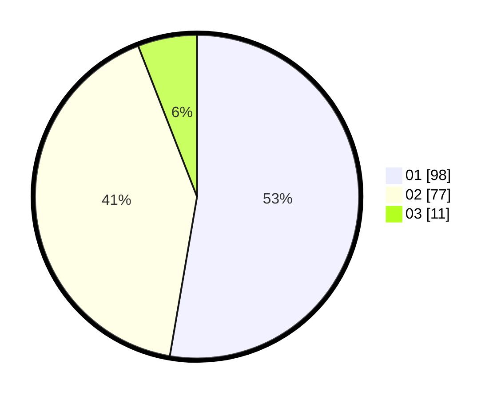

# Hasil

Hasil perolehan suara paslon dapat dilihat pada file paslon-01.txt, paslon-02.txt, dan paslon-03.txt.

Jika tidak ada, artinya data tersebut belum ada pada SIREKAP.

## Perolehan Suara

 * Paslon 01: **98**.
 * Paslon 02: **77**.
 * Paslon 03: **11**.

## Foto C Plano

https://sirekap-obj-formc.kpu.go.id/750b/pemilu/ppwp/31/71/03/10/08/3171031008049-20240214-190623--383a52de-81b5-4111-adb0-2d21bb42229d.jpg

https://sirekap-obj-formc.kpu.go.id/750b/pemilu/ppwp/31/71/03/10/08/3171031008049-20240214-190645--2a69362f-0f7c-4e62-a175-fab672f4ebff.jpg

https://sirekap-obj-formc.kpu.go.id/750b/pemilu/ppwp/31/71/03/10/08/3171031008049-20240214-190634--539c6db1-da7b-4f0c-9eab-f51e076672d3.jpg

## DATA PEMILIH TETAP

Jumlah pemilih dalam DPT: **188**.
 * L: **85**.
 * P: **103**.

## DATA PENGGUNA HAK PILIH

Jumlah pengguna hak pilih dalam DPT: **188**.
 * L: **85**.
 * P: **103**.

Jumlah pengguna hak pilih dalam DPTb: **2**.
 * L: **0**.
 * P: **2**.

Jumlah pengguna hak pilih dalam DPK: **0**.
 * L: **0**.
 * P: **0**.

Jumlah pengguna hak pilih: **190**.
 * L: **85**.
 * P: **105**.

## JUMLAH SUARA SAH DAN TIDAK SAH

JUMLAH SELURUH SUARA SAH: **186**.

JUMLAH SUARA TIDAK SAH: **4**.

JUMLAH SELURUH SUARA SAH DAN SUARA TIDAK SAH: **190**.
