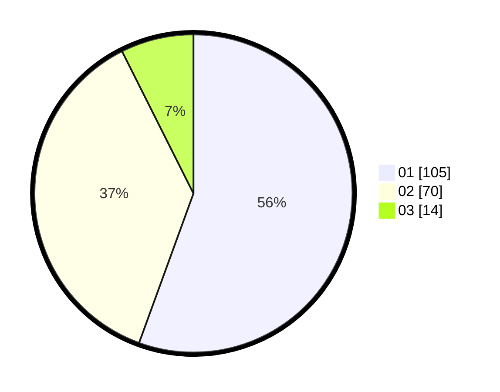

# Hasil

Hasil perolehan suara paslon dapat dilihat pada file paslon-01.txt, paslon-02.txt, dan paslon-03.txt.

Jika tidak ada, artinya data tersebut belum ada pada SIREKAP.

## Perolehan Suara

 * Paslon 01: **105**.
 * Paslon 02: **70**.
 * Paslon 03: **14**.

## Foto C Plano

https://sirekap-obj-formc.kpu.go.id/1ce6/pemilu/ppwp/31/71/03/10/08/3171031008050-20240215-093321--2d9e38b8-aaaa-43fd-a0da-99f36a04abc4.jpg

https://sirekap-obj-formc.kpu.go.id/1ce6/pemilu/ppwp/31/71/03/10/08/3171031008050-20240215-093327--b01b2e9d-010d-487a-b77a-d0c14e21533e.jpg

https://sirekap-obj-formc.kpu.go.id/1ce6/pemilu/ppwp/31/71/03/10/08/3171031008050-20240215-093330--6049dbb9-848d-43e5-a602-2dc125e94713.jpg
