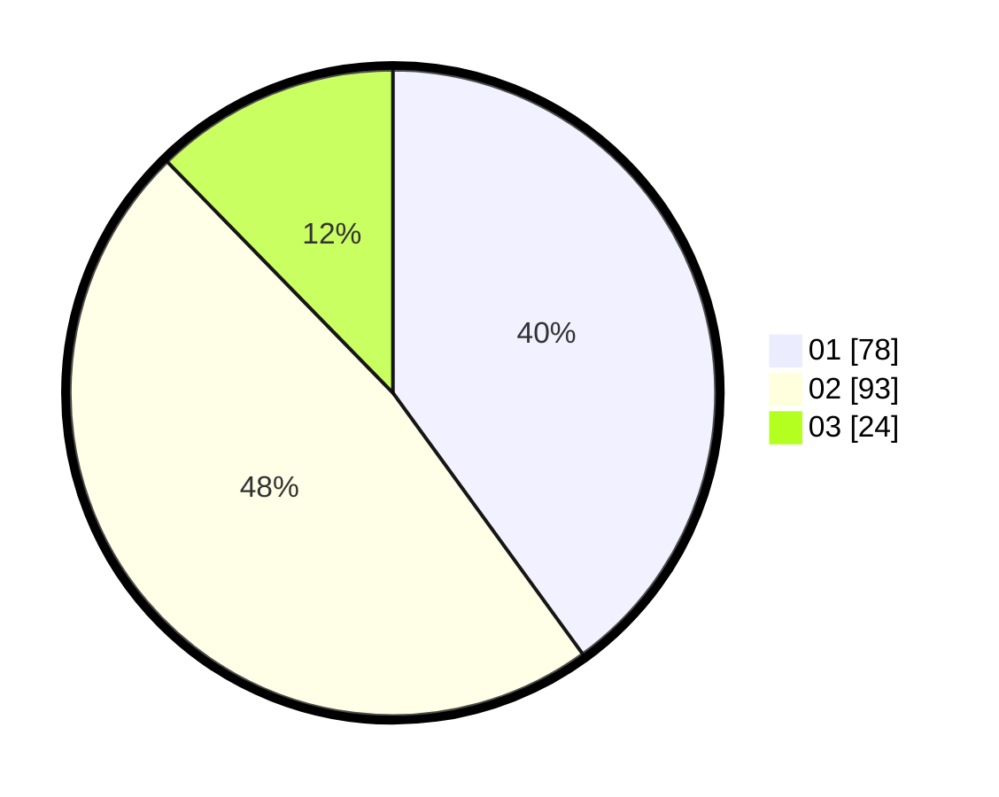

# Hasil

Hasil perolehan suara paslon dapat dilihat pada file paslon-01.txt, paslon-02.txt, dan paslon-03.txt.

Jika tidak ada, artinya data tersebut belum ada pada SIREKAP.

## Perolehan Suara

 * Paslon 01: **78**.
 * Paslon 02: **93**.
 * Paslon 03: **24**.

## Foto C Plano

https://sirekap-obj-formc.kpu.go.id/c79f/pemilu/ppwp/31/71/03/10/08/3171031008053-20240216-203514--f44412a5-a81f-410d-b31a-486bc973355f.jpg

https://sirekap-obj-formc.kpu.go.id/c79f/pemilu/ppwp/31/71/03/10/08/3171031008053-20240218-135845--43e4d7a4-375b-49ff-8093-ebbf4ec8cf5e.jpg

https://sirekap-obj-formc.kpu.go.id/c79f/pemilu/ppwp/31/71/03/10/08/3171031008053-20240218-132237--ff12a271-d21c-44b8-987f-858c627a8a4a.jpg
