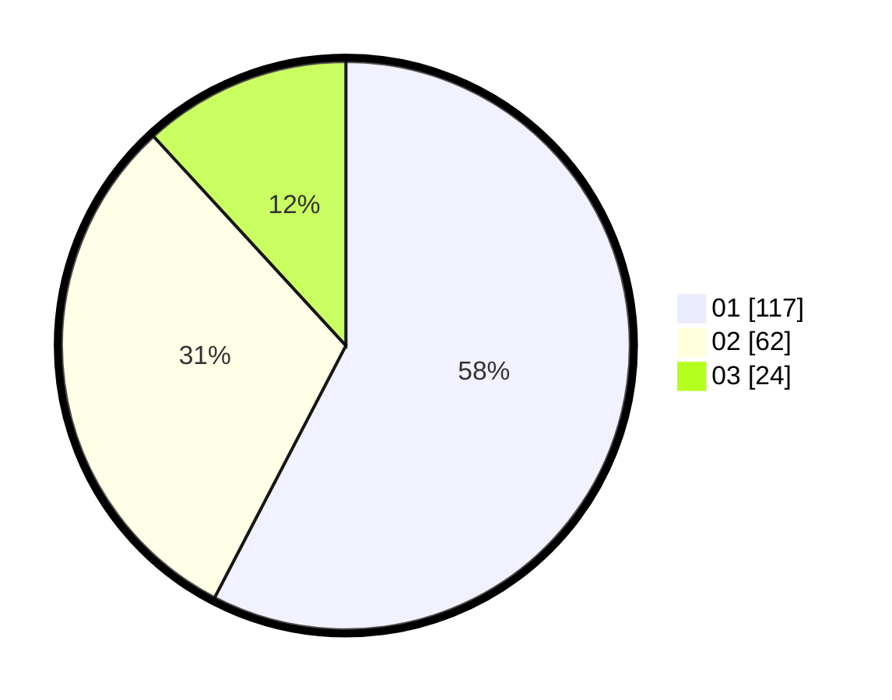

# Hasil

Hasil perolehan suara paslon dapat dilihat pada file paslon-01.txt, paslon-02.txt, dan paslon-03.txt.

Jika tidak ada, artinya data tersebut belum ada pada SIREKAP.

## Perolehan Suara

 * Paslon 01: **117**.
 * Paslon 02: **62**.
 * Paslon 03: **24**.

## Foto C Plano

https://sirekap-obj-formc.kpu.go.id/963b/pemilu/ppwp/31/71/03/10/08/3171031008056-20240216-015742--b0f586b3-62d9-4900-bd1b-37e1ec05b599.jpg

https://sirekap-obj-formc.kpu.go.id/963b/pemilu/ppwp/31/71/03/10/08/3171031008056-20240216-015743--39cf2fc5-8057-4940-a1ad-0667c2fb9aae.jpg

https://sirekap-obj-formc.kpu.go.id/963b/pemilu/ppwp/31/71/03/10/08/3171031008056-20240216-015743--bbbd0ccc-1926-4332-bea8-79707c8d22d3.jpg

## DATA PEMILIH TETAP

Jumlah pemilih dalam DPT: **275**.
 * L: **150**.
 * P: **125**.

## DATA PENGGUNA HAK PILIH

Jumlah pengguna hak pilih dalam DPT: **197**.
 * L: **107**.
 * P: **90**.

Jumlah pengguna hak pilih dalam DPTb: **7**.
 * L: **4**.
 * P: **3**.

Jumlah pengguna hak pilih dalam DPK: **2**.
 * L: **0**.
 * P: **2**.

Jumlah pengguna hak pilih: **206**.
 * L: **111**.
 * P: **95**.

## JUMLAH SUARA SAH DAN TIDAK SAH

JUMLAH SELURUH SUARA SAH: **203**.

JUMLAH SUARA TIDAK SAH: **3**.

JUMLAH SELURUH SUARA SAH DAN SUARA TIDAK SAH: **206**.
