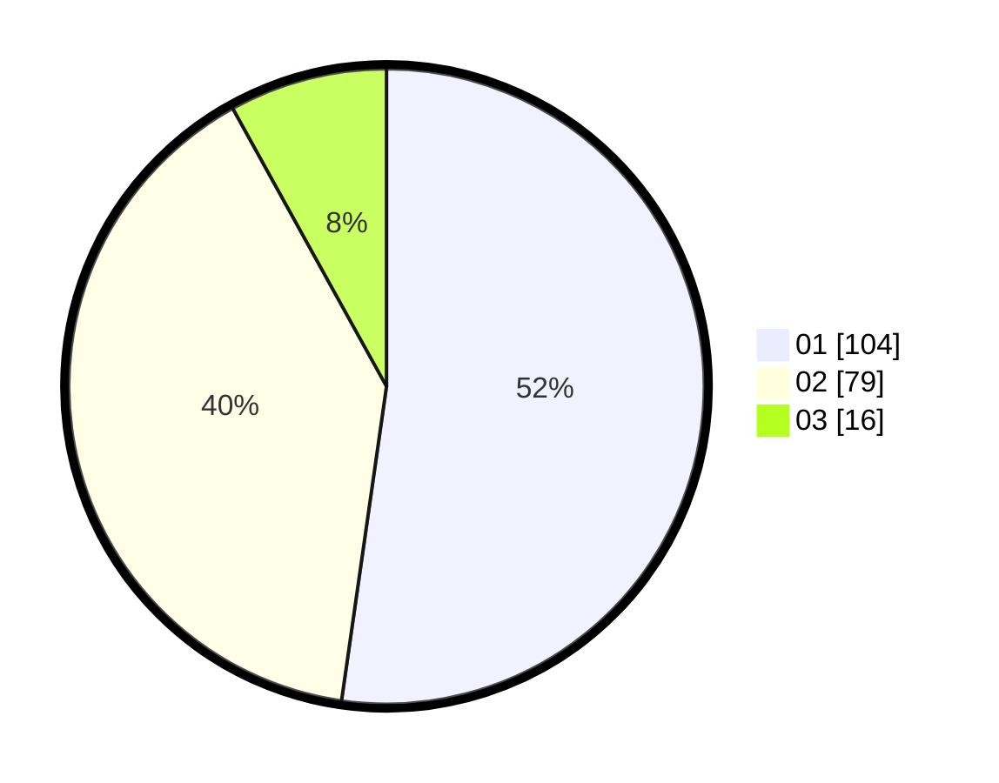

# Hasil

Hasil perolehan suara paslon dapat dilihat pada file paslon-01.txt, paslon-02.txt, dan paslon-03.txt.

Jika tidak ada, artinya data tersebut belum ada pada SIREKAP.

## Perolehan Suara

 * Paslon 01: **104**.
 * Paslon 02: **79**.
 * Paslon 03: **16**.

## Foto C Plano

https://sirekap-obj-formc.kpu.go.id/9037/pemilu/ppwp/31/71/03/10/08/3171031008059-20240216-155425--502a2461-840d-4a22-bcd3-e8b14c27f7da.jpg

https://sirekap-obj-formc.kpu.go.id/9037/pemilu/ppwp/31/71/03/10/08/3171031008059-20240216-155427--bb2eafbb-a562-4bff-85e7-d74b4fcd2b33.jpg

https://sirekap-obj-formc.kpu.go.id/9037/pemilu/ppwp/31/71/03/10/08/3171031008059-20240216-155426--eb5f9791-7170-4cad-b721-eddb4892173c.jpg

## DATA PEMILIH TETAP

Jumlah pemilih dalam DPT: **202**.
 * L: **96**.
 * P: **106**.

## DATA PENGGUNA HAK PILIH

Jumlah pengguna hak pilih dalam DPT: **202**.
 * L: **96**.
 * P: **106**.

Jumlah pengguna hak pilih dalam DPTb: **0**.
 * L: **0**.
 * P: **0**.

Jumlah pengguna hak pilih dalam DPK: **2**.
 * L: **1**.
 * P: **1**.

Jumlah pengguna hak pilih: **204**.
 * L: **97**.
 * P: **107**.

## JUMLAH SUARA SAH DAN TIDAK SAH

JUMLAH SELURUH SUARA SAH: **199**.

JUMLAH SUARA TIDAK SAH: **5**.

JUMLAH SELURUH SUARA SAH DAN SUARA TIDAK SAH: **204**.
