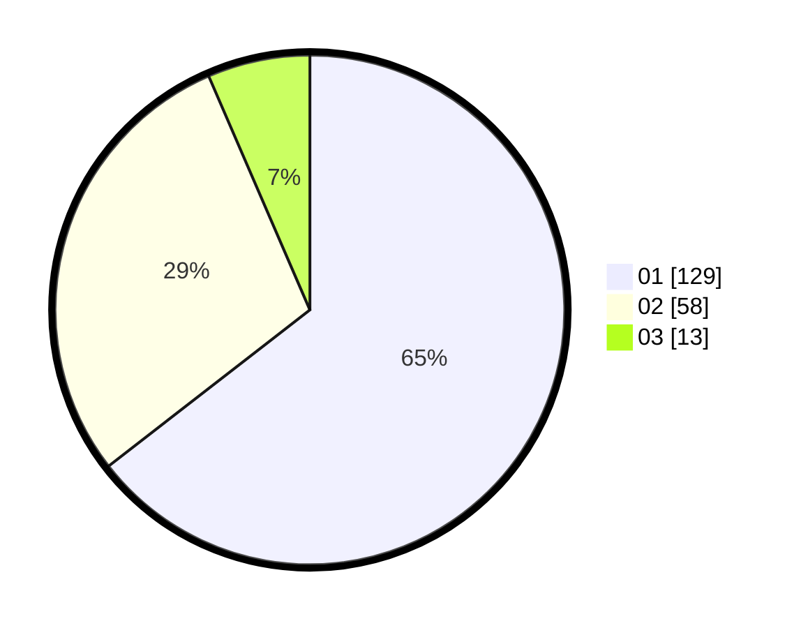

# Hasil

Hasil perolehan suara paslon dapat dilihat pada file paslon-01.txt, paslon-02.txt, dan paslon-03.txt.

Jika tidak ada, artinya data tersebut belum ada pada SIREKAP.

## Perolehan Suara

 * Paslon 01: **129**.
 * Paslon 02: **58**.
 * Paslon 03: **13**.

## Foto C Plano

https://sirekap-obj-formc.kpu.go.id/a7e8/pemilu/ppwp/31/71/03/10/08/3171031008060-20240216-142159--d9560f68-ae11-4e41-ab6e-3280e193f0f7.jpg

https://sirekap-obj-formc.kpu.go.id/a7e8/pemilu/ppwp/31/71/03/10/08/3171031008060-20240216-142200--4f65a1ee-376c-4818-83fe-9249a0fc8fbf.jpg

https://sirekap-obj-formc.kpu.go.id/a7e8/pemilu/ppwp/31/71/03/10/08/3171031008060-20240216-142159--01fbac3e-357e-4d4d-8f8e-7a7975b0b0d0.jpg

## DATA PEMILIH TETAP

Jumlah pemilih dalam DPT: **0**.
 * L: **0**.
 * P: **0**.

## DATA PENGGUNA HAK PILIH

Jumlah pengguna hak pilih dalam DPT: **0**.
 * L: **0**.
 * P: **0**.

Jumlah pengguna hak pilih dalam DPTb: **0**.
 * L: **0**.
 * P: **0**.

Jumlah pengguna hak pilih dalam DPK: **0**.
 * L: **0**.
 * P: **0**.

Jumlah pengguna hak pilih: **0**.
 * L: **0**.
 * P: **0**.

## JUMLAH SUARA SAH DAN TIDAK SAH

JUMLAH SELURUH SUARA SAH: **200**.

JUMLAH SUARA TIDAK SAH: **6**.

JUMLAH SELURUH SUARA SAH DAN SUARA TIDAK SAH: **206**.
