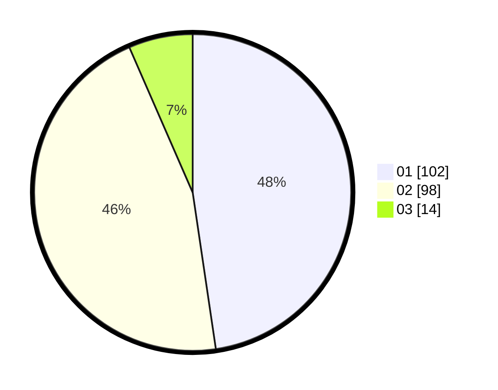

# Hasil

Hasil perolehan suara paslon dapat dilihat pada file paslon-01.txt, paslon-02.txt, dan paslon-03.txt.

Jika tidak ada, artinya data tersebut belum ada pada SIREKAP.

## Perolehan Suara

 * Paslon 01: **102**.
 * Paslon 02: **98**.
 * Paslon 03: **14**.

## Foto C Plano

https://sirekap-obj-formc.kpu.go.id/9e44/pemilu/ppwp/31/71/03/10/08/3171031008062-20240214-185243--536cd0d7-5e59-4ec1-b40e-e303c160fd1e.jpg

https://sirekap-obj-formc.kpu.go.id/9e44/pemilu/ppwp/31/71/03/10/08/3171031008062-20240214-185201--52ba96fa-08ee-4bd6-8e39-befd690534f8.jpg

https://sirekap-obj-formc.kpu.go.id/9e44/pemilu/ppwp/31/71/03/10/08/3171031008062-20240214-184852--0f37fff1-f159-4a0d-bf8b-a82b03ae5f63.jpg

## DATA PEMILIH TETAP

Jumlah pemilih dalam DPT: **276**.
 * L: **140**.
 * P: **136**.

## DATA PENGGUNA HAK PILIH

Jumlah pengguna hak pilih dalam DPT: **221**.
 * L: **107**.
 * P: **114**.

Jumlah pengguna hak pilih dalam DPTb: **0**.
 * L: **0**.
 * P: **0**.

Jumlah pengguna hak pilih dalam DPK: **0**.
 * L: **0**.
 * P: **0**.

Jumlah pengguna hak pilih: **221**.
 * L: **107**.
 * P: **114**.

## JUMLAH SUARA SAH DAN TIDAK SAH

JUMLAH SELURUH SUARA SAH: **214**.

JUMLAH SUARA TIDAK SAH: **7**.

JUMLAH SELURUH SUARA SAH DAN SUARA TIDAK SAH: **221**.
