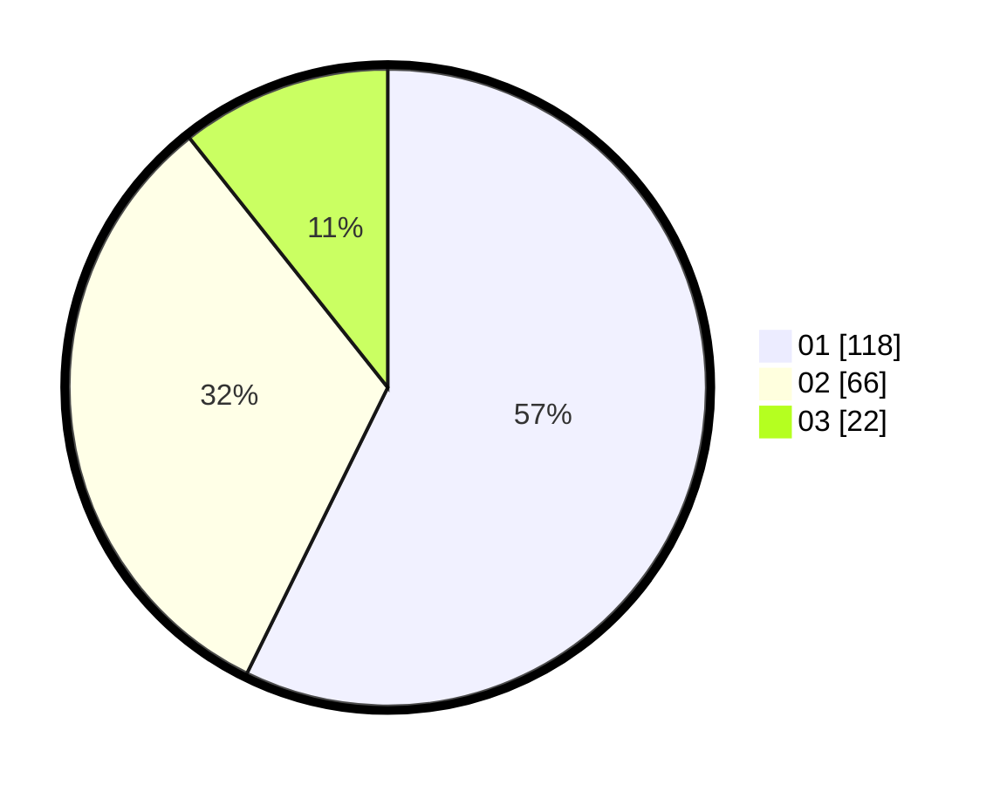

# Hasil

Hasil perolehan suara paslon dapat dilihat pada file paslon-01.txt, paslon-02.txt, dan paslon-03.txt.

Jika tidak ada, artinya data tersebut belum ada pada SIREKAP.

## Perolehan Suara

 * Paslon 01: **118**.
 * Paslon 02: **66**.
 * Paslon 03: **22**.

## Foto C Plano

https://sirekap-obj-formc.kpu.go.id/660a/pemilu/ppwp/31/71/03/10/08/3171031008063-20240214-155044--c983043b-c56e-43ae-8397-4298facc3859.jpg

https://sirekap-obj-formc.kpu.go.id/660a/pemilu/ppwp/31/71/03/10/08/3171031008063-20240216-115719--9142e7fa-783f-4779-a82f-1076f7561827.jpg

https://sirekap-obj-formc.kpu.go.id/660a/pemilu/ppwp/31/71/03/10/08/3171031008063-20240216-115715--1d0fd4d9-3d9e-4f0a-a4d4-884e2d81b7f4.jpg

## DATA PEMILIH TETAP

Jumlah pemilih dalam DPT: **280**.
 * L: **151**.
 * P: **129**.

## DATA PENGGUNA HAK PILIH

Jumlah pengguna hak pilih dalam DPT: **209**.
 * L: **105**.
 * P: **104**.

Jumlah pengguna hak pilih dalam DPTb: **0**.
 * L: **0**.
 * P: **0**.

Jumlah pengguna hak pilih dalam DPK: **0**.
 * L: **0**.
 * P: **0**.

Jumlah pengguna hak pilih: **209**.
 * L: **105**.
 * P: **104**.

## JUMLAH SUARA SAH DAN TIDAK SAH

JUMLAH SELURUH SUARA SAH: **206**.

JUMLAH SUARA TIDAK SAH: **3**.

JUMLAH SELURUH SUARA SAH DAN SUARA TIDAK SAH: **209**.
