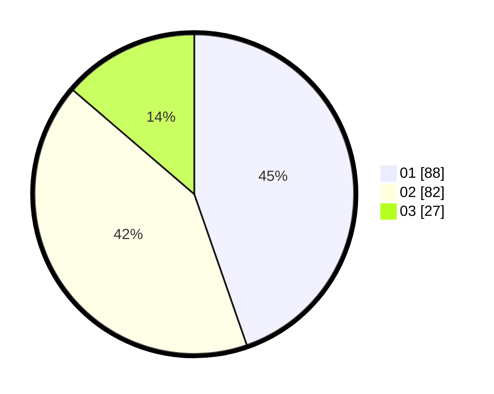

# Hasil

Hasil perolehan suara paslon dapat dilihat pada file paslon-01.txt, paslon-02.txt, dan paslon-03.txt.

Jika tidak ada, artinya data tersebut belum ada pada SIREKAP.

## Perolehan Suara

 * Paslon 01: **88**.
 * Paslon 02: **82**.
 * Paslon 03: **27**.

## Foto C Plano

https://sirekap-obj-formc.kpu.go.id/50fe/pemilu/ppwp/31/71/03/10/08/3171031008064-20240216-220535--8aecfbaf-2606-4cd4-89cd-68e5b655ed9d.jpg

https://sirekap-obj-formc.kpu.go.id/50fe/pemilu/ppwp/31/71/03/10/08/3171031008064-20240215-011233--a4d4ebcb-94a8-4742-b7b5-1715a06f8d51.jpg

https://sirekap-obj-formc.kpu.go.id/50fe/pemilu/ppwp/31/71/03/10/08/3171031008064-20240215-011253--6b9cbb47-d476-453b-8b1e-3eff699225d7.jpg

## DATA PEMILIH TETAP

Jumlah pemilih dalam DPT: **271**.
 * L: **136**.
 * P: **135**.

## DATA PENGGUNA HAK PILIH

Jumlah pengguna hak pilih dalam DPT: **200**.
 * L: **100**.
 * P: **100**.

Jumlah pengguna hak pilih dalam DPTb: **2**.
 * L: **1**.
 * P: **1**.

Jumlah pengguna hak pilih dalam DPK: **3**.
 * L: **1**.
 * P: **2**.

Jumlah pengguna hak pilih: **205**.
 * L: **102**.
 * P: **103**.

## JUMLAH SUARA SAH DAN TIDAK SAH

JUMLAH SELURUH SUARA SAH: **197**.

JUMLAH SUARA TIDAK SAH: **8**.

JUMLAH SELURUH SUARA SAH DAN SUARA TIDAK SAH: **205**.
