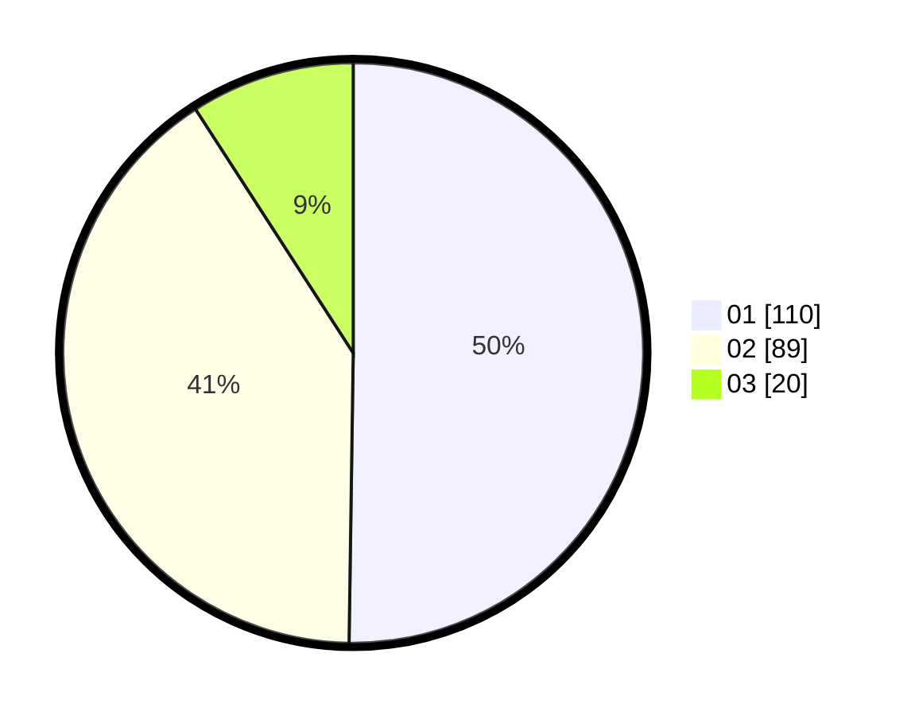

# Hasil

Hasil perolehan suara paslon dapat dilihat pada file paslon-01.txt, paslon-02.txt, dan paslon-03.txt.

Jika tidak ada, artinya data tersebut belum ada pada SIREKAP.

## Perolehan Suara

 * Paslon 01: **110**.
 * Paslon 02: **89**.
 * Paslon 03: **20**.

## Foto C Plano

https://sirekap-obj-formc.kpu.go.id/6b21/pemilu/ppwp/31/71/03/10/08/3171031008066-20240214-184520--12e90ca3-505a-43f8-ad8e-07c208c05ef6.jpg

https://sirekap-obj-formc.kpu.go.id/6b21/pemilu/ppwp/31/71/03/10/08/3171031008066-20240214-184653--c0bd7d76-94e7-4b03-810e-d480ad5871b5.jpg

https://sirekap-obj-formc.kpu.go.id/6b21/pemilu/ppwp/31/71/03/10/08/3171031008066-20240214-184630--e6d8b835-9606-4afb-820f-10242d3f2d3e.jpg

## DATA PEMILIH TETAP

Jumlah pemilih dalam DPT: **272**.
 * L: **134**.
 * P: **138**.

## DATA PENGGUNA HAK PILIH

Jumlah pengguna hak pilih dalam DPT: **216**.
 * L: **102**.
 * P: **114**.

Jumlah pengguna hak pilih dalam DPTb: **3**.
 * L: **1**.
 * P: **2**.

Jumlah pengguna hak pilih dalam DPK: **2**.
 * L: **1**.
 * P: **1**.

Jumlah pengguna hak pilih: **221**.
 * L: **104**.
 * P: **117**.

## JUMLAH SUARA SAH DAN TIDAK SAH

JUMLAH SELURUH SUARA SAH: **219**.

JUMLAH SUARA TIDAK SAH: **2**.

JUMLAH SELURUH SUARA SAH DAN SUARA TIDAK SAH: **221**.
