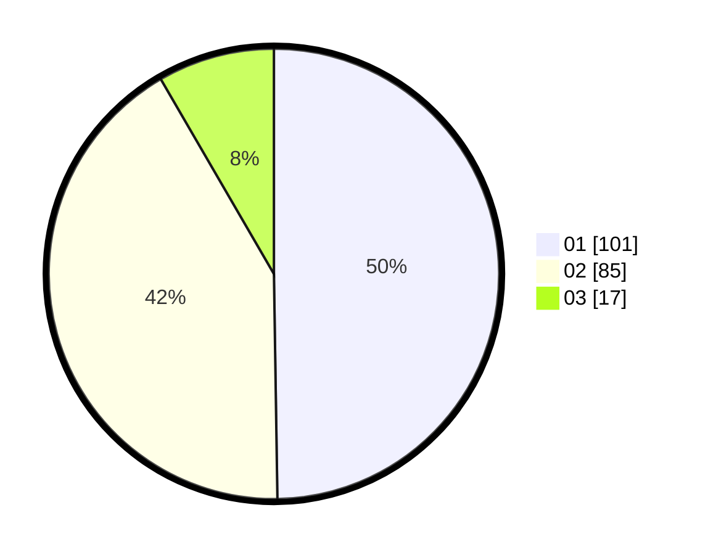

# Hasil

Hasil perolehan suara paslon dapat dilihat pada file paslon-01.txt, paslon-02.txt, dan paslon-03.txt.

Jika tidak ada, artinya data tersebut belum ada pada SIREKAP.

## Perolehan Suara

 * Paslon 01: **101**.
 * Paslon 02: **85**.
 * Paslon 03: **17**.

## Foto C Plano

https://sirekap-obj-formc.kpu.go.id/9ef8/pemilu/ppwp/31/71/03/10/08/3171031008067-20240214-215504--65e62475-a66e-41e0-9d05-d5b10deb2d3f.jpg

https://sirekap-obj-formc.kpu.go.id/9ef8/pemilu/ppwp/31/71/03/10/08/3171031008067-20240214-215555--3ff15ed7-66e9-4c92-b029-42db5b0cccc6.jpg

https://sirekap-obj-formc.kpu.go.id/9ef8/pemilu/ppwp/31/71/03/10/08/3171031008067-20240214-200340--e1803056-f868-4225-93f3-3ff56ffa7b43.jpg

## DATA PEMILIH TETAP

Jumlah pemilih dalam DPT: **276**.
 * L: **133**.
 * P: **143**.

## DATA PENGGUNA HAK PILIH

Jumlah pengguna hak pilih dalam DPT: **203**.
 * L: **95**.
 * P: **108**.

Jumlah pengguna hak pilih dalam DPTb: **2**.
 * L: **1**.
 * P: **1**.

Jumlah pengguna hak pilih dalam DPK: **2**.
 * L: **0**.
 * P: **2**.

Jumlah pengguna hak pilih: **207**.
 * L: **96**.
 * P: **111**.

## JUMLAH SUARA SAH DAN TIDAK SAH

JUMLAH SELURUH SUARA SAH: **203**.

JUMLAH SUARA TIDAK SAH: **4**.

JUMLAH SELURUH SUARA SAH DAN SUARA TIDAK SAH: **207**.
