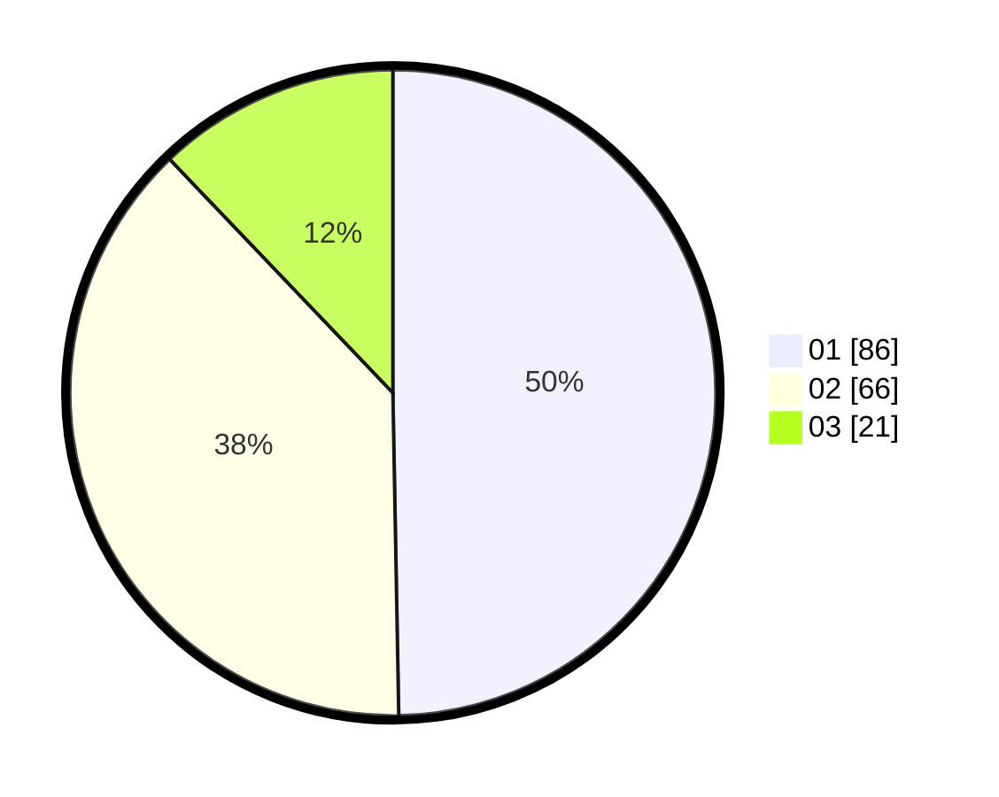

# Hasil

Hasil perolehan suara paslon dapat dilihat pada file paslon-01.txt, paslon-02.txt, dan paslon-03.txt.

Jika tidak ada, artinya data tersebut belum ada pada SIREKAP.

## Perolehan Suara

 * Paslon 01: **86**.
 * Paslon 02: **66**.
 * Paslon 03: **21**.

## Foto C Plano

https://sirekap-obj-formc.kpu.go.id/67be/pemilu/ppwp/31/71/03/10/08/3171031008070-20240216-160012--927993be-816e-4343-b71f-255105d4fea3.jpg

https://sirekap-obj-formc.kpu.go.id/67be/pemilu/ppwp/31/71/03/10/08/3171031008070-20240216-160013--a77ff075-43cf-4102-ae88-4bf8392f1eee.jpg

https://sirekap-obj-formc.kpu.go.id/67be/pemilu/ppwp/31/71/03/10/08/3171031008070-20240216-160012--7f712b3e-6860-4a2e-9d82-a4d5397396b9.jpg

## DATA PEMILIH TETAP

Jumlah pemilih dalam DPT: **232**.
 * L: **107**.
 * P: **125**.

## DATA PENGGUNA HAK PILIH

Jumlah pengguna hak pilih dalam DPT: **166**.
 * L: **71**.
 * P: **95**.

Jumlah pengguna hak pilih dalam DPTb: **1**.
 * L: **1**.
 * P: **0**.

Jumlah pengguna hak pilih dalam DPK: **6**.
 * L: **3**.
 * P: **3**.

Jumlah pengguna hak pilih: **173**.
 * L: **75**.
 * P: **98**.

## JUMLAH SUARA SAH DAN TIDAK SAH

JUMLAH SELURUH SUARA SAH: **173**.

JUMLAH SUARA TIDAK SAH: **0**.

JUMLAH SELURUH SUARA SAH DAN SUARA TIDAK SAH: **173**.
