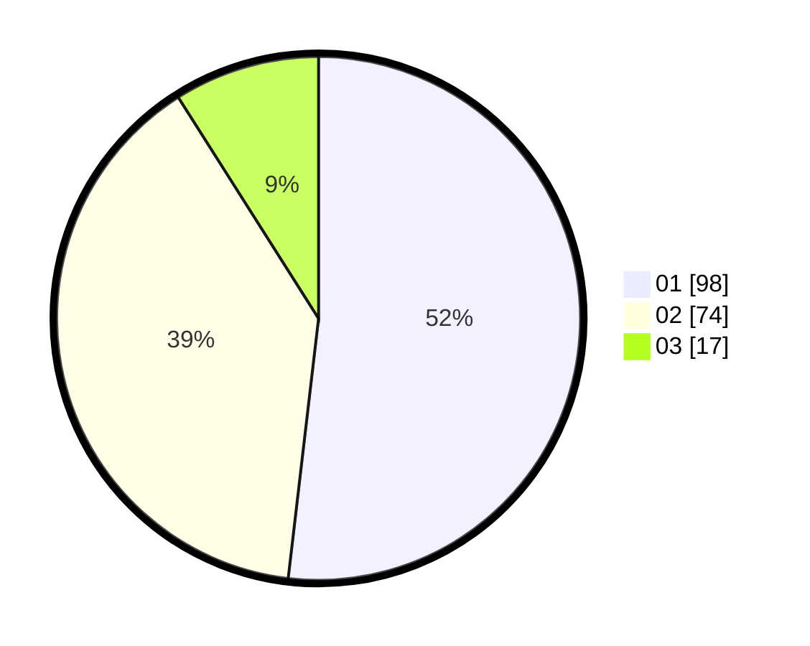

# Hasil

Hasil perolehan suara paslon dapat dilihat pada file paslon-01.txt, paslon-02.txt, dan paslon-03.txt.

Jika tidak ada, artinya data tersebut belum ada pada SIREKAP.

## Perolehan Suara

 * Paslon 01: **98**.
 * Paslon 02: **74**.
 * Paslon 03: **17**.

## Foto C Plano

https://sirekap-obj-formc.kpu.go.id/dbc2/pemilu/ppwp/31/71/03/10/08/3171031008071-20240215-222149--cfce55eb-9117-4686-a1a9-075434d14995.jpg

https://sirekap-obj-formc.kpu.go.id/dbc2/pemilu/ppwp/31/71/03/10/08/3171031008071-20240215-222150--3b8b0764-2ba8-4a0b-a2ba-01fa5a79fbe1.jpg

https://sirekap-obj-formc.kpu.go.id/dbc2/pemilu/ppwp/31/71/03/10/08/3171031008071-20240215-222149--c4bb6249-8e8f-4ca8-a48a-99ec5747969a.jpg

## DATA PEMILIH TETAP

Jumlah pemilih dalam DPT: **243**.
 * L: **122**.
 * P: **121**.

## DATA PENGGUNA HAK PILIH

Jumlah pengguna hak pilih dalam DPT: **187**.
 * L: **90**.
 * P: **97**.

Jumlah pengguna hak pilih dalam DPTb: **2**.
 * L: **1**.
 * P: **1**.

Jumlah pengguna hak pilih dalam DPK: **0**.
 * L: **0**.
 * P: **0**.

Jumlah pengguna hak pilih: **189**.
 * L: **91**.
 * P: **98**.

## JUMLAH SUARA SAH DAN TIDAK SAH

JUMLAH SELURUH SUARA SAH: **189**.

JUMLAH SUARA TIDAK SAH: **0**.

JUMLAH SELURUH SUARA SAH DAN SUARA TIDAK SAH: **189**.
