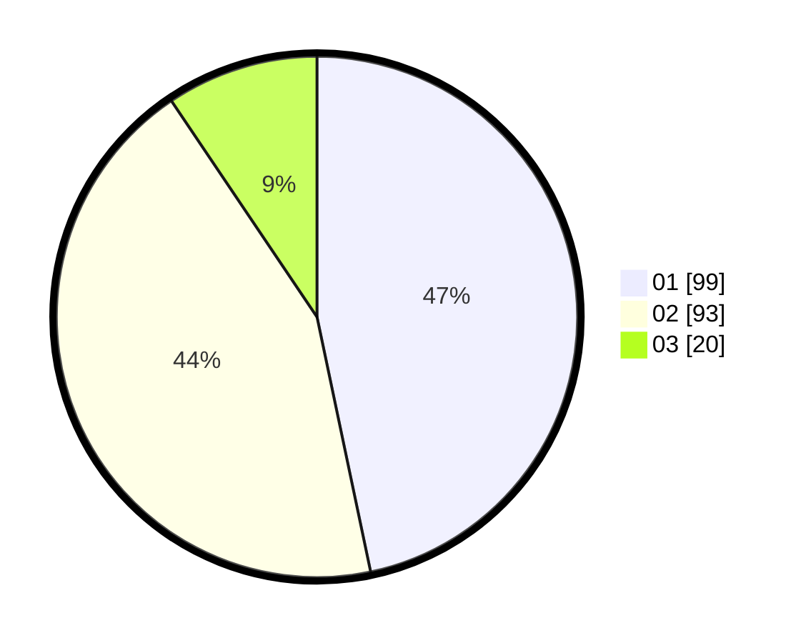

# Hasil

Hasil perolehan suara paslon dapat dilihat pada file paslon-01.txt, paslon-02.txt, dan paslon-03.txt.

Jika tidak ada, artinya data tersebut belum ada pada SIREKAP.

## Perolehan Suara

 * Paslon 01: **99**.
 * Paslon 02: **93**.
 * Paslon 03: **20**.

## Foto C Plano

https://sirekap-obj-formc.kpu.go.id/204d/pemilu/ppwp/31/71/03/10/08/3171031008077-20240214-195412--7b031f0c-a1a6-4b69-a2bc-02d211bc53f9.jpg

https://sirekap-obj-formc.kpu.go.id/204d/pemilu/ppwp/31/71/03/10/08/3171031008077-20240214-195556--a56dc520-a596-4c40-936c-d4fb62acd8b7.jpg

https://sirekap-obj-formc.kpu.go.id/204d/pemilu/ppwp/31/71/03/10/08/3171031008077-20240214-202001--54dcc972-bbb6-4c56-b8d2-bf70f2b258a9.jpg

## DATA PEMILIH TETAP

Jumlah pemilih dalam DPT: **278**.
 * L: **147**.
 * P: **174**.

## DATA PENGGUNA HAK PILIH

Jumlah pengguna hak pilih dalam DPT: **217**.
 * L: **104**.
 * P: **105**.

Jumlah pengguna hak pilih dalam DPTb: **1**.
 * L: **81**.
 * P: **0**.

Jumlah pengguna hak pilih dalam DPK: **0**.
 * L: **0**.
 * P: **0**.

Jumlah pengguna hak pilih: **214**.
 * L: **109**.
 * P: **105**.

## JUMLAH SUARA SAH DAN TIDAK SAH

JUMLAH SELURUH SUARA SAH: **212**.

JUMLAH SUARA TIDAK SAH: **2**.

JUMLAH SELURUH SUARA SAH DAN SUARA TIDAK SAH: **214**.
