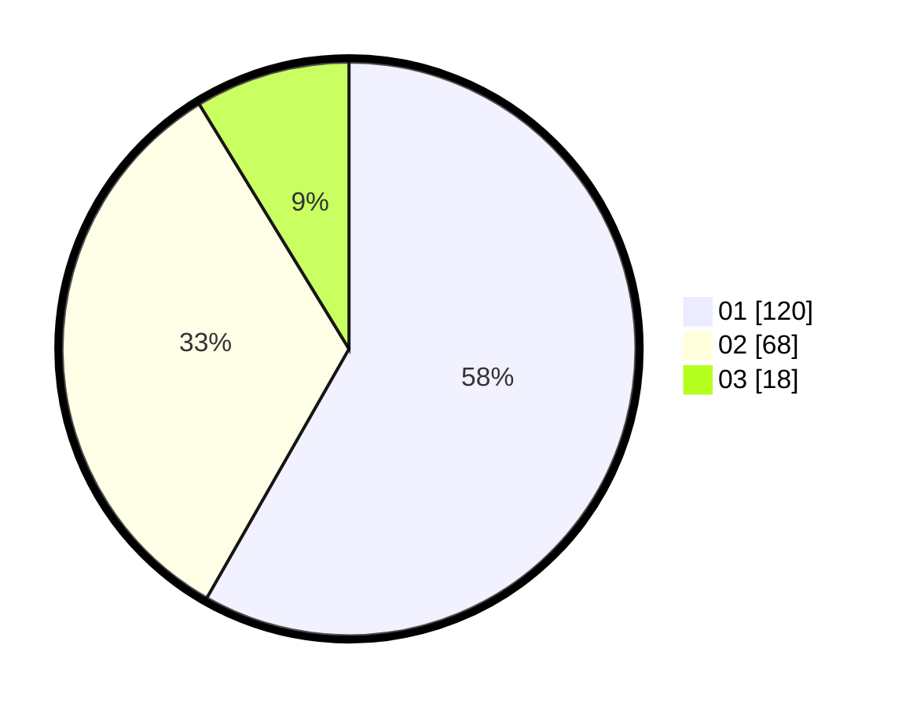

# Hasil

Hasil perolehan suara paslon dapat dilihat pada file paslon-01.txt, paslon-02.txt, dan paslon-03.txt.

Jika tidak ada, artinya data tersebut belum ada pada SIREKAP.

## Perolehan Suara

 * Paslon 01: **120**.
 * Paslon 02: **68**.
 * Paslon 03: **18**.

## Foto C Plano

https://sirekap-obj-formc.kpu.go.id/a1a9/pemilu/ppwp/31/71/03/10/08/3171031008078-20240214-214153--5b69b9e3-0971-45da-91bf-d8807f265935.jpg

https://sirekap-obj-formc.kpu.go.id/a1a9/pemilu/ppwp/31/71/03/10/08/3171031008078-20240214-214214--6c455b23-4105-4157-94ac-c9e9e41fc187.jpg

https://sirekap-obj-formc.kpu.go.id/a1a9/pemilu/ppwp/31/71/03/10/08/3171031008078-20240214-214204--bdf06a68-432e-4f27-b6fe-0b11a2874a37.jpg

## DATA PEMILIH TETAP

Jumlah pemilih dalam DPT: **272**.
 * L: **143**.
 * P: **129**.

## DATA PENGGUNA HAK PILIH

Jumlah pengguna hak pilih dalam DPT: **206**.
 * L: **106**.
 * P: **100**.

Jumlah pengguna hak pilih dalam DPTb: **0**.
 * L: **0**.
 * P: **0**.

Jumlah pengguna hak pilih dalam DPK: **4**.
 * L: **2**.
 * P: **2**.

Jumlah pengguna hak pilih: **0**.
 * L: **0**.
 * P: **0**.

## JUMLAH SUARA SAH DAN TIDAK SAH

JUMLAH SELURUH SUARA SAH: **206**.

JUMLAH SUARA TIDAK SAH: **4**.

JUMLAH SELURUH SUARA SAH DAN SUARA TIDAK SAH: **210**.
