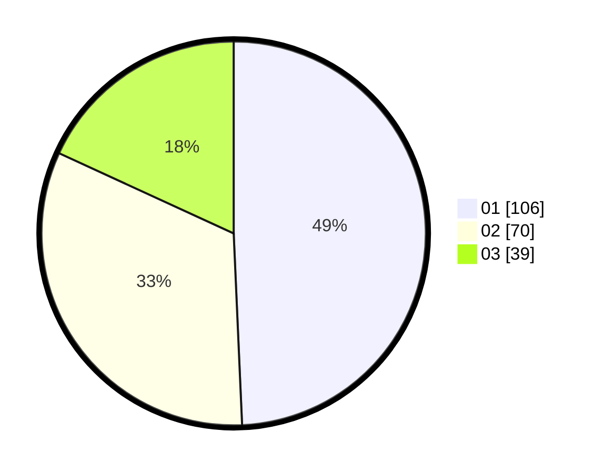

# Hasil

Hasil perolehan suara paslon dapat dilihat pada file paslon-01.txt, paslon-02.txt, dan paslon-03.txt.

Jika tidak ada, artinya data tersebut belum ada pada SIREKAP.

## Perolehan Suara

 * Paslon 01: **106**.
 * Paslon 02: **70**.
 * Paslon 03: **39**.

## Foto C Plano

https://sirekap-obj-formc.kpu.go.id/58c9/pemilu/ppwp/31/71/03/10/08/3171031008081-20240216-140053--af959549-7e9d-448a-90de-8f4e447d6cfb.jpg

https://sirekap-obj-formc.kpu.go.id/58c9/pemilu/ppwp/31/71/03/10/08/3171031008081-20240214-214646--992fe034-da9b-4d47-8057-87c2cf9325bc.jpg

https://sirekap-obj-formc.kpu.go.id/58c9/pemilu/ppwp/31/71/03/10/08/3171031008081-20240214-214711--ef32015f-5d73-4cf0-9393-43b9080d3eca.jpg

## DATA PEMILIH TETAP

Jumlah pemilih dalam DPT: **286**.
 * L: **146**.
 * P: **140**.

## DATA PENGGUNA HAK PILIH

Jumlah pengguna hak pilih dalam DPT: **214**.
 * L: **106**.
 * P: **108**.

Jumlah pengguna hak pilih dalam DPTb: **1**.
 * L: **1**.
 * P: **0**.

Jumlah pengguna hak pilih dalam DPK: **3**.
 * L: **1**.
 * P: **2**.

Jumlah pengguna hak pilih: **218**.
 * L: **108**.
 * P: **110**.

## JUMLAH SUARA SAH DAN TIDAK SAH

JUMLAH SELURUH SUARA SAH: **215**.

JUMLAH SUARA TIDAK SAH: **3**.

JUMLAH SELURUH SUARA SAH DAN SUARA TIDAK SAH: **218**.
