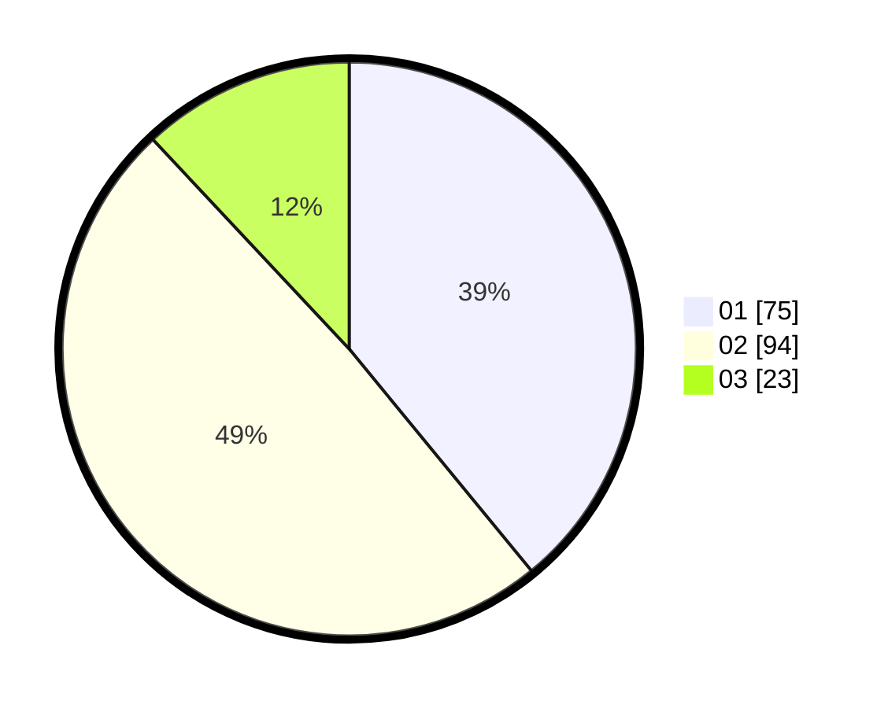

# Hasil

Hasil perolehan suara paslon dapat dilihat pada file paslon-01.txt, paslon-02.txt, dan paslon-03.txt.

Jika tidak ada, artinya data tersebut belum ada pada SIREKAP.

## Perolehan Suara

 * Paslon 01: **75**.
 * Paslon 02: **94**.
 * Paslon 03: **23**.

## Foto C Plano

https://sirekap-obj-formc.kpu.go.id/33c1/pemilu/ppwp/31/71/03/10/08/3171031008082-20240215-172525--385d93d8-798b-4a55-afe2-a98ea9681890.jpg

https://sirekap-obj-formc.kpu.go.id/33c1/pemilu/ppwp/31/71/03/10/08/3171031008082-20240215-172547--fa212f74-da56-4ceb-9e7c-b6a877dc2439.jpg

https://sirekap-obj-formc.kpu.go.id/33c1/pemilu/ppwp/31/71/03/10/08/3171031008082-20240215-172536--92c37997-8f93-47f8-9017-d5330caf45b3.jpg

## DATA PEMILIH TETAP

Jumlah pemilih dalam DPT: **283**.
 * L: **140**.
 * P: **143**.

## DATA PENGGUNA HAK PILIH

Jumlah pengguna hak pilih dalam DPT: **194**.
 * L: **90**.
 * P: **104**.

Jumlah pengguna hak pilih dalam DPTb: **0**.
 * L: **0**.
 * P: **0**.

Jumlah pengguna hak pilih dalam DPK: **0**.
 * L: **0**.
 * P: **0**.

Jumlah pengguna hak pilih: **194**.
 * L: **90**.
 * P: **104**.

## JUMLAH SUARA SAH DAN TIDAK SAH

JUMLAH SELURUH SUARA SAH: **192**.

JUMLAH SUARA TIDAK SAH: **2**.

JUMLAH SELURUH SUARA SAH DAN SUARA TIDAK SAH: **194**.
