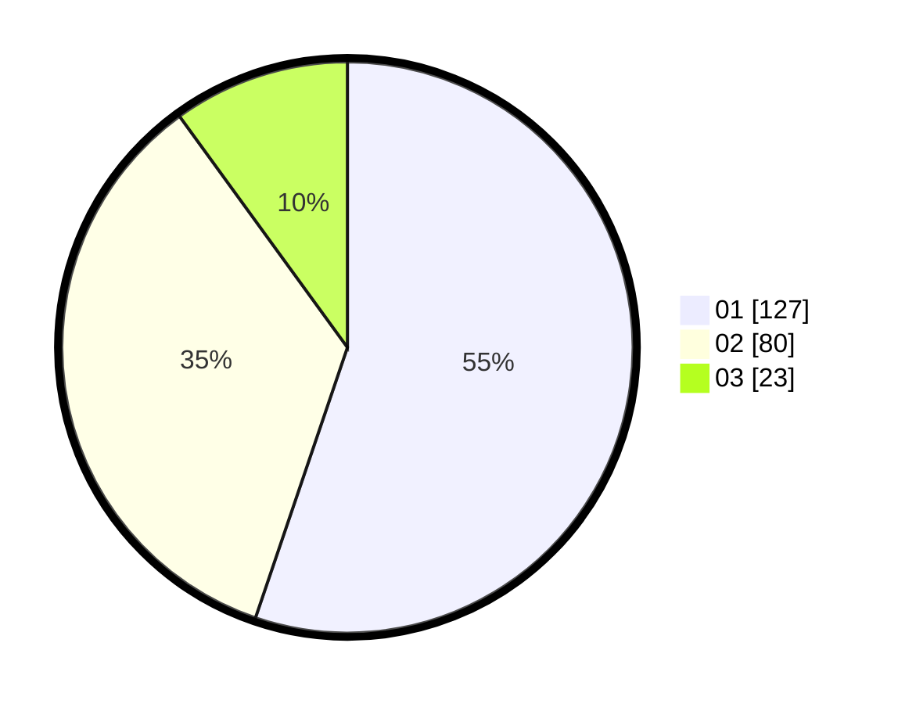

# Hasil

Hasil perolehan suara paslon dapat dilihat pada file paslon-01.txt, paslon-02.txt, dan paslon-03.txt.

Jika tidak ada, artinya data tersebut belum ada pada SIREKAP.

## Perolehan Suara

 * Paslon 01: **127**.
 * Paslon 02: **80**.
 * Paslon 03: **23**.

## Foto C Plano

https://sirekap-obj-formc.kpu.go.id/9505/pemilu/ppwp/31/71/03/10/08/3171031008085-20240214-195721--abe373d7-f6a0-4a5e-bc66-65bcfcc20396.jpg

https://sirekap-obj-formc.kpu.go.id/9505/pemilu/ppwp/31/71/03/10/08/3171031008085-20240214-195743--6d0b5ef5-10d1-48dd-96ad-fa288b6aa40b.jpg

https://sirekap-obj-formc.kpu.go.id/9505/pemilu/ppwp/31/71/03/10/08/3171031008085-20240214-195732--97a89c32-36db-4b96-96a1-821a96af65dd.jpg

## DATA PEMILIH TETAP

Jumlah pemilih dalam DPT: **295**.
 * L: **150**.
 * P: **145**.

## DATA PENGGUNA HAK PILIH

Jumlah pengguna hak pilih dalam DPT: **229**.
 * L: **106**.
 * P: **123**.

Jumlah pengguna hak pilih dalam DPTb: **0**.
 * L: **0**.
 * P: **0**.

Jumlah pengguna hak pilih dalam DPK: **1**.
 * L: **1**.
 * P: **0**.

Jumlah pengguna hak pilih: **230**.
 * L: **107**.
 * P: **123**.

## JUMLAH SUARA SAH DAN TIDAK SAH

JUMLAH SELURUH SUARA SAH: **230**.

JUMLAH SUARA TIDAK SAH: **0**.

JUMLAH SELURUH SUARA SAH DAN SUARA TIDAK SAH: **230**.
