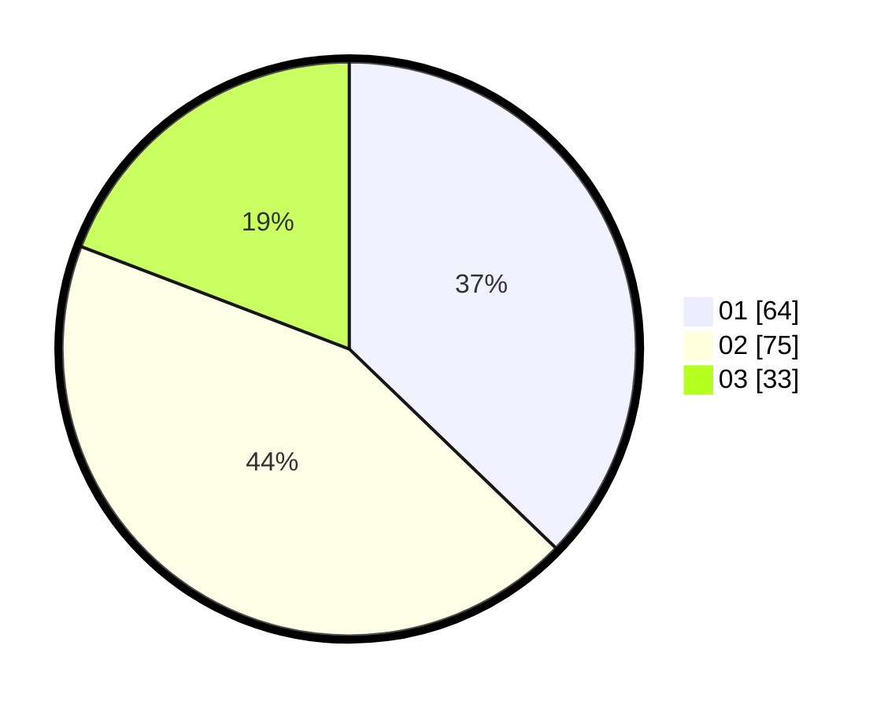

# Hasil

Hasil perolehan suara paslon dapat dilihat pada file paslon-01.txt, paslon-02.txt, dan paslon-03.txt.

Jika tidak ada, artinya data tersebut belum ada pada SIREKAP.

## Perolehan Suara

 * Paslon 01: **64**.
 * Paslon 02: **75**.
 * Paslon 03: **33**.

## Foto C Plano

https://sirekap-obj-formc.kpu.go.id/4c68/pemilu/ppwp/31/71/03/10/08/3171031008086-20240215-023736--43cae938-e9c2-43f8-af7c-a058a5de1c48.jpg

https://sirekap-obj-formc.kpu.go.id/4c68/pemilu/ppwp/31/71/03/10/08/3171031008086-20240215-023757--e3b3b414-f918-465b-8b29-bab6e8a16f47.jpg

https://sirekap-obj-formc.kpu.go.id/4c68/pemilu/ppwp/31/71/03/10/08/3171031008086-20240215-023746--3957ec33-34b4-4d2b-8962-4162f1281073.jpg

## DATA PEMILIH TETAP

Jumlah pemilih dalam DPT: **263**.
 * L: **125**.
 * P: **138**.

## DATA PENGGUNA HAK PILIH

Jumlah pengguna hak pilih dalam DPT: **168**.
 * L: **75**.
 * P: **93**.

Jumlah pengguna hak pilih dalam DPTb: **2**.
 * L: **2**.
 * P: **0**.

Jumlah pengguna hak pilih dalam DPK: **2**.
 * L: **1**.
 * P: **1**.

Jumlah pengguna hak pilih: **172**.
 * L: **78**.
 * P: **94**.

## JUMLAH SUARA SAH DAN TIDAK SAH

JUMLAH SELURUH SUARA SAH: **172**.

JUMLAH SUARA TIDAK SAH: **0**.

JUMLAH SELURUH SUARA SAH DAN SUARA TIDAK SAH: **172**.
