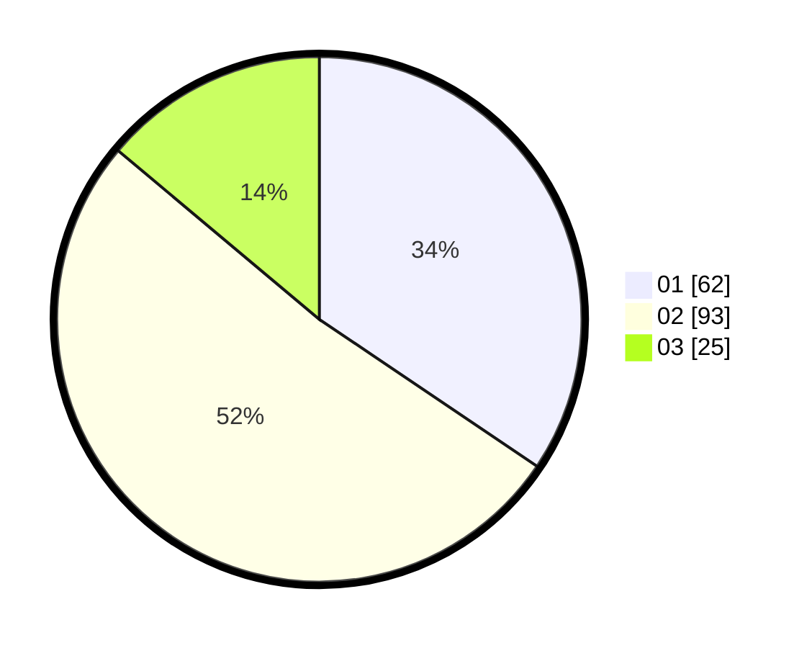

# Hasil

Hasil perolehan suara paslon dapat dilihat pada file paslon-01.txt, paslon-02.txt, dan paslon-03.txt.

Jika tidak ada, artinya data tersebut belum ada pada SIREKAP.

## Perolehan Suara

 * Paslon 01: **62**.
 * Paslon 02: **93**.
 * Paslon 03: **25**.

## Foto C Plano

https://sirekap-obj-formc.kpu.go.id/6ca2/pemilu/ppwp/31/71/03/10/08/3171031008087-20240215-061702--ed984609-78f2-4a24-a268-0c0719008055.jpg

https://sirekap-obj-formc.kpu.go.id/6ca2/pemilu/ppwp/31/71/03/10/08/3171031008087-20240215-061723--ef7f4c19-f55e-4163-84d8-d8e1476c5174.jpg

https://sirekap-obj-formc.kpu.go.id/6ca2/pemilu/ppwp/31/71/03/10/08/3171031008087-20240215-061712--34bc1ff8-55ed-4b88-8b18-c19b43f5c1de.jpg

## DATA PEMILIH TETAP

Jumlah pemilih dalam DPT: **0**.
 * L: **0**.
 * P: **0**.

## DATA PENGGUNA HAK PILIH

Jumlah pengguna hak pilih dalam DPT: **0**.
 * L: **0**.
 * P: **0**.

Jumlah pengguna hak pilih dalam DPTb: **0**.
 * L: **0**.
 * P: **0**.

Jumlah pengguna hak pilih dalam DPK: **0**.
 * L: **0**.
 * P: **0**.

Jumlah pengguna hak pilih: **0**.
 * L: **0**.
 * P: **0**.

## JUMLAH SUARA SAH DAN TIDAK SAH

JUMLAH SELURUH SUARA SAH: **180**.

JUMLAH SUARA TIDAK SAH: **4**.

JUMLAH SELURUH SUARA SAH DAN SUARA TIDAK SAH: **184**.
