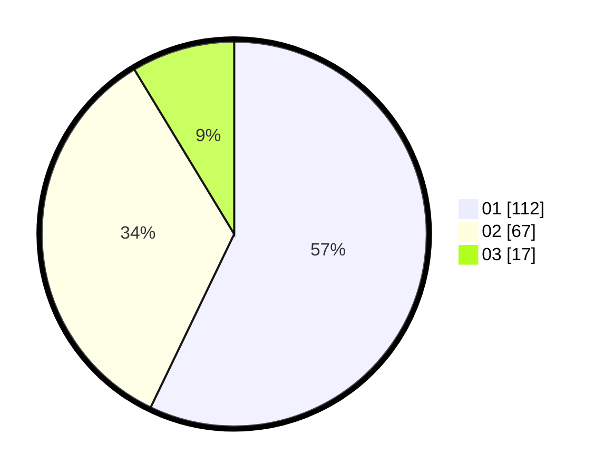

# Hasil

Hasil perolehan suara paslon dapat dilihat pada file paslon-01.txt, paslon-02.txt, dan paslon-03.txt.

Jika tidak ada, artinya data tersebut belum ada pada SIREKAP.

## Perolehan Suara

 * Paslon 01: **112**.
 * Paslon 02: **67**.
 * Paslon 03: **17**.

## Foto C Plano

https://sirekap-obj-formc.kpu.go.id/becb/pemilu/ppwp/31/71/03/10/08/3171031008094-20240215-210725--24abec81-0d21-4aba-a11b-cfc46b16c758.jpg

https://sirekap-obj-formc.kpu.go.id/becb/pemilu/ppwp/31/71/03/10/08/3171031008094-20240215-210727--e481ecf5-c3c6-411b-9c50-bd87b6521373.jpg

https://sirekap-obj-formc.kpu.go.id/becb/pemilu/ppwp/31/71/03/10/08/3171031008094-20240215-210726--19b641b4-167f-4281-a1d9-4e5e4727da5e.jpg

## DATA PEMILIH TETAP

Jumlah pemilih dalam DPT: **275**.
 * L: **134**.
 * P: **141**.

## DATA PENGGUNA HAK PILIH

Jumlah pengguna hak pilih dalam DPT: **197**.
 * L: **93**.
 * P: **104**.

Jumlah pengguna hak pilih dalam DPTb: **0**.
 * L: **0**.
 * P: **0**.

Jumlah pengguna hak pilih dalam DPK: **1**.
 * L: **0**.
 * P: **1**.

Jumlah pengguna hak pilih: **198**.
 * L: **93**.
 * P: **105**.

## JUMLAH SUARA SAH DAN TIDAK SAH

JUMLAH SELURUH SUARA SAH: **196**.

JUMLAH SUARA TIDAK SAH: **2**.

JUMLAH SELURUH SUARA SAH DAN SUARA TIDAK SAH: **198**.
