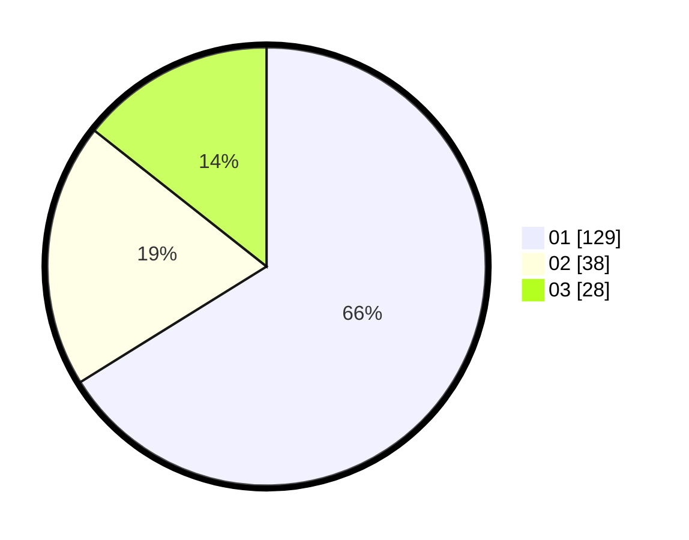

# Hasil

Hasil perolehan suara paslon dapat dilihat pada file paslon-01.txt, paslon-02.txt, dan paslon-03.txt.

Jika tidak ada, artinya data tersebut belum ada pada SIREKAP.

## Perolehan Suara

 * Paslon 01: **129**.
 * Paslon 02: **38**.
 * Paslon 03: **28**.

## Foto C Plano

https://sirekap-obj-formc.kpu.go.id/4380/pemilu/ppwp/31/71/03/10/08/3171031008095-20240216-152631--a168a2c2-2d35-4eb5-9efa-d8738ba56e73.jpg

https://sirekap-obj-formc.kpu.go.id/4380/pemilu/ppwp/31/71/03/10/08/3171031008095-20240216-152632--cece35a0-839c-40fd-bff0-f9ebeef6db11.jpg

https://sirekap-obj-formc.kpu.go.id/4380/pemilu/ppwp/31/71/03/10/08/3171031008095-20240216-152631--e916ef93-01a8-4352-8680-2fb56b6c1601.jpg

## DATA PEMILIH TETAP

Jumlah pemilih dalam DPT: **0**.
 * L: **0**.
 * P: **0**.

## DATA PENGGUNA HAK PILIH

Jumlah pengguna hak pilih dalam DPT: **197**.
 * L: **96**.
 * P: **101**.

Jumlah pengguna hak pilih dalam DPTb: **0**.
 * L: **0**.
 * P: **0**.

Jumlah pengguna hak pilih dalam DPK: **0**.
 * L: **1**.
 * P: **0**.

Jumlah pengguna hak pilih: **198**.
 * L: **97**.
 * P: **101**.

## JUMLAH SUARA SAH DAN TIDAK SAH

JUMLAH SELURUH SUARA SAH: **195**.

JUMLAH SUARA TIDAK SAH: **3**.

JUMLAH SELURUH SUARA SAH DAN SUARA TIDAK SAH: **198**.
