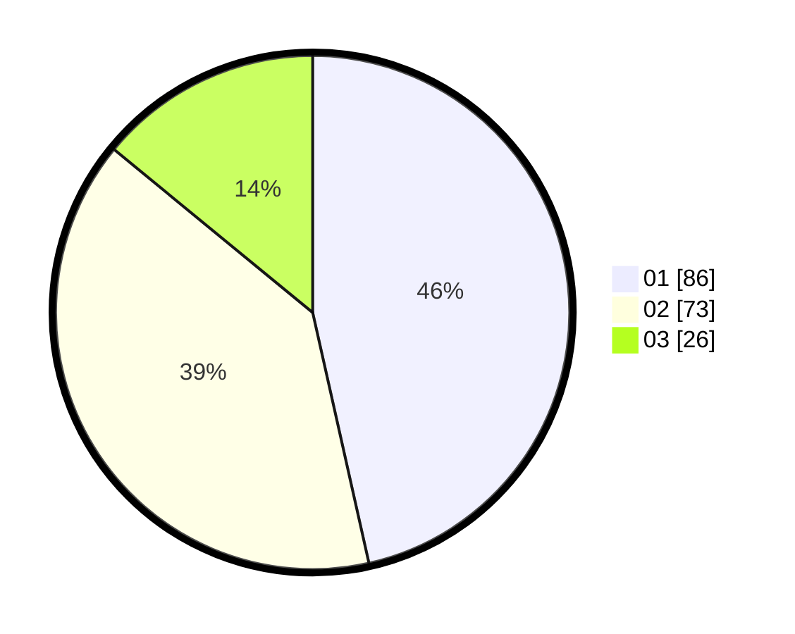

# Hasil

Hasil perolehan suara paslon dapat dilihat pada file paslon-01.txt, paslon-02.txt, dan paslon-03.txt.

Jika tidak ada, artinya data tersebut belum ada pada SIREKAP.

## Perolehan Suara

 * Paslon 01: **86**.
 * Paslon 02: **73**.
 * Paslon 03: **26**.

## Foto C Plano

https://sirekap-obj-formc.kpu.go.id/0990/pemilu/ppwp/31/71/03/10/08/3171031008098-20240216-151215--ff54d20e-309e-48dc-854f-fcb61d728d19.jpg

https://sirekap-obj-formc.kpu.go.id/0990/pemilu/ppwp/31/71/03/10/08/3171031008098-20240216-111404--4b32467b-355f-4f73-9515-4aabe1e05f8d.jpg

https://sirekap-obj-formc.kpu.go.id/0990/pemilu/ppwp/31/71/03/10/08/3171031008098-20240216-111358--19157fb9-6e29-4060-9c1d-38db38f6856b.jpg

## DATA PEMILIH TETAP

Jumlah pemilih dalam DPT: **259**.
 * L: **140**.
 * P: **119**.

## DATA PENGGUNA HAK PILIH

Jumlah pengguna hak pilih dalam DPT: **192**.
 * L: **104**.
 * P: **88**.

Jumlah pengguna hak pilih dalam DPTb: **0**.
 * L: **0**.
 * P: **0**.

Jumlah pengguna hak pilih dalam DPK: **1**.
 * L: **0**.
 * P: **1**.

Jumlah pengguna hak pilih: **193**.
 * L: **104**.
 * P: **89**.

## JUMLAH SUARA SAH DAN TIDAK SAH

JUMLAH SELURUH SUARA SAH: **185**.

JUMLAH SUARA TIDAK SAH: **8**.

JUMLAH SELURUH SUARA SAH DAN SUARA TIDAK SAH: **193**.
