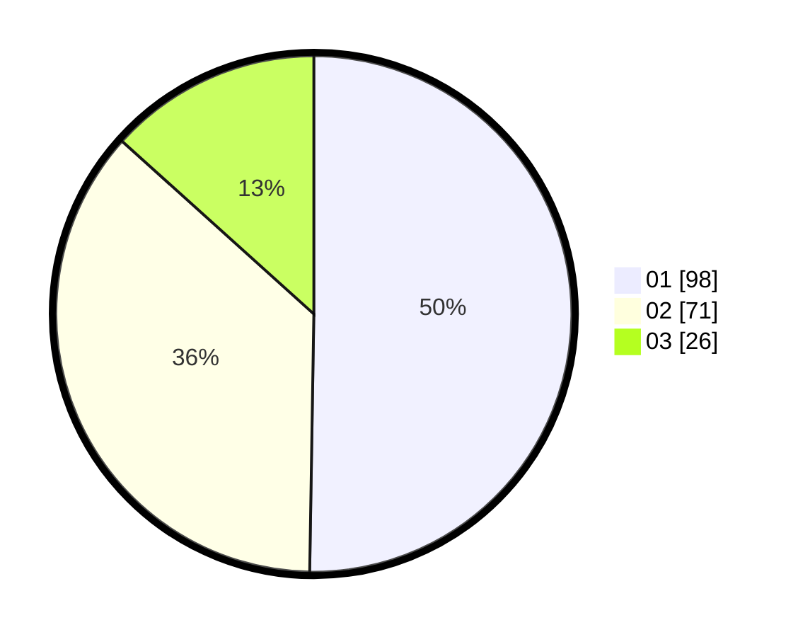

# Hasil

Hasil perolehan suara paslon dapat dilihat pada file paslon-01.txt, paslon-02.txt, dan paslon-03.txt.

Jika tidak ada, artinya data tersebut belum ada pada SIREKAP.

## Perolehan Suara

 * Paslon 01: **98**.
 * Paslon 02: **71**.
 * Paslon 03: **26**.

## Foto C Plano

https://sirekap-obj-formc.kpu.go.id/5dff/pemilu/ppwp/31/71/03/10/08/3171031008099-20240216-144958--a8e5ae74-6b86-40c0-a86b-9e625137f139.jpg

https://sirekap-obj-formc.kpu.go.id/5dff/pemilu/ppwp/31/71/03/10/08/3171031008099-20240216-144959--83b195b7-47f2-4cb7-83bf-f852d97d87b6.jpg

https://sirekap-obj-formc.kpu.go.id/5dff/pemilu/ppwp/31/71/03/10/08/3171031008099-20240216-144958--f397fc9f-cd94-4071-9bc3-b210dd48297e.jpg

## DATA PEMILIH TETAP

Jumlah pemilih dalam DPT: **247**.
 * L: **132**.
 * P: **115**.

## DATA PENGGUNA HAK PILIH

Jumlah pengguna hak pilih dalam DPT: **199**.
 * L: **100**.
 * P: **99**.

Jumlah pengguna hak pilih dalam DPTb: **0**.
 * L: **0**.
 * P: **0**.

Jumlah pengguna hak pilih dalam DPK: **0**.
 * L: **0**.
 * P: **0**.

Jumlah pengguna hak pilih: **199**.
 * L: **100**.
 * P: **99**.

## JUMLAH SUARA SAH DAN TIDAK SAH

JUMLAH SELURUH SUARA SAH: **195**.

JUMLAH SUARA TIDAK SAH: **4**.

JUMLAH SELURUH SUARA SAH DAN SUARA TIDAK SAH: **199**.
