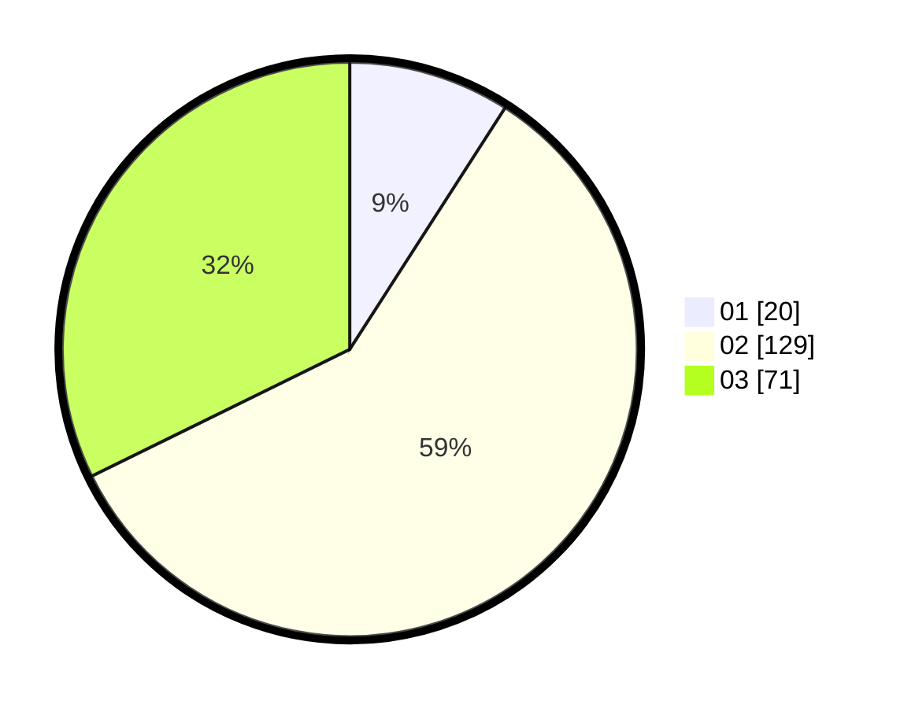

# Hasil

Hasil perolehan suara paslon dapat dilihat pada file paslon-01.txt, paslon-02.txt, dan paslon-03.txt.

Jika tidak ada, artinya data tersebut belum ada pada SIREKAP.

## Perolehan Suara

 * Paslon 01: **20**.
 * Paslon 02: **129**.
 * Paslon 03: **71**.

## Foto C Plano

https://sirekap-obj-formc.kpu.go.id/7186/pemilu/ppwp/31/71/04/10/01/3171041001001-20240216-150229--4d9d0b48-49c3-4311-9c85-d5be530dd759.jpg

https://sirekap-obj-formc.kpu.go.id/7186/pemilu/ppwp/31/71/04/10/01/3171041001001-20240216-151123--e4d7cc40-1491-4b3f-be21-b8548c6221c7.jpg

https://sirekap-obj-formc.kpu.go.id/7186/pemilu/ppwp/31/71/04/10/01/3171041001001-20240216-152917--38522e51-9131-44b1-bfc4-7d502873f9e5.jpg

## DATA PEMILIH TETAP

Jumlah pemilih dalam DPT: **262**.
 * L: **134**.
 * P: **128**.

## DATA PENGGUNA HAK PILIH

Jumlah pengguna hak pilih dalam DPT: **203**.
 * L: **103**.
 * P: **100**.

Jumlah pengguna hak pilih dalam DPTb: **13**.
 * L: **5**.
 * P: **8**.

Jumlah pengguna hak pilih dalam DPK: **5**.
 * L: **4**.
 * P: **1**.

Jumlah pengguna hak pilih: **221**.
 * L: **112**.
 * P: **109**.

## JUMLAH SUARA SAH DAN TIDAK SAH

JUMLAH SELURUH SUARA SAH: **220**.

JUMLAH SUARA TIDAK SAH: **1**.

JUMLAH SELURUH SUARA SAH DAN SUARA TIDAK SAH: **221**.
