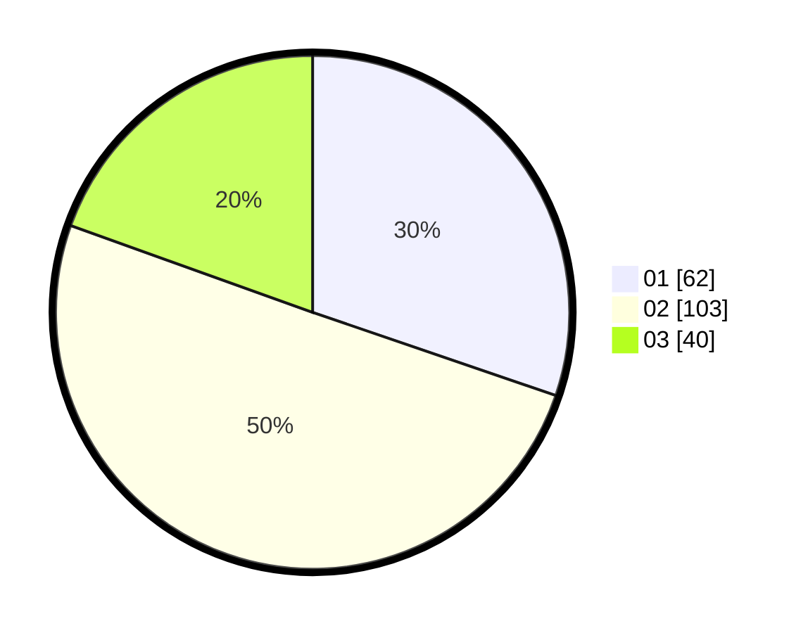

# Hasil

Hasil perolehan suara paslon dapat dilihat pada file paslon-01.txt, paslon-02.txt, dan paslon-03.txt.

Jika tidak ada, artinya data tersebut belum ada pada SIREKAP.

## Perolehan Suara

 * Paslon 01: **62**.
 * Paslon 02: **103**.
 * Paslon 03: **40**.

## Foto C Plano

https://sirekap-obj-formc.kpu.go.id/789d/pemilu/ppwp/31/71/04/10/01/3171041001003-20240216-175147--36b4fabb-6612-488a-8342-754000a17763.jpg

https://sirekap-obj-formc.kpu.go.id/789d/pemilu/ppwp/31/71/04/10/01/3171041001003-20240216-175148--1d983ccd-e16f-45b5-8a53-21753f820ddd.jpg

https://sirekap-obj-formc.kpu.go.id/789d/pemilu/ppwp/31/71/04/10/01/3171041001003-20240216-175147--30d65a9d-dce3-45af-898b-612eaea64297.jpg

## DATA PEMILIH TETAP

Jumlah pemilih dalam DPT: **271**.
 * L: **122**.
 * P: **149**.

## DATA PENGGUNA HAK PILIH

Jumlah pengguna hak pilih dalam DPT: **178**.
 * L: **75**.
 * P: **103**.

Jumlah pengguna hak pilih dalam DPTb: **24**.
 * L: **12**.
 * P: **12**.

Jumlah pengguna hak pilih dalam DPK: **7**.
 * L: **3**.
 * P: **4**.

Jumlah pengguna hak pilih: **209**.
 * L: **90**.
 * P: **119**.

## JUMLAH SUARA SAH DAN TIDAK SAH

JUMLAH SELURUH SUARA SAH: **205**.

JUMLAH SUARA TIDAK SAH: **4**.

JUMLAH SELURUH SUARA SAH DAN SUARA TIDAK SAH: **209**.
