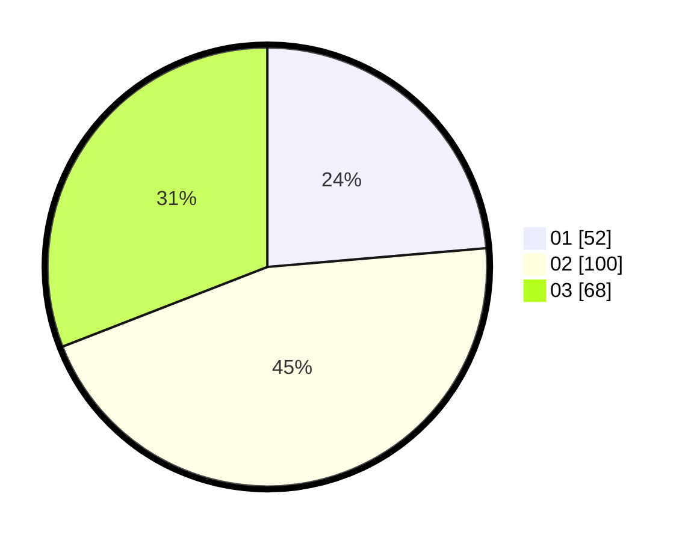

# Hasil

Hasil perolehan suara paslon dapat dilihat pada file paslon-01.txt, paslon-02.txt, dan paslon-03.txt.

Jika tidak ada, artinya data tersebut belum ada pada SIREKAP.

## Perolehan Suara

 * Paslon 01: **52**.
 * Paslon 02: **100**.
 * Paslon 03: **68**.

## Foto C Plano

https://sirekap-obj-formc.kpu.go.id/d087/pemilu/ppwp/31/71/04/10/01/3171041001005-20240216-152427--3123420c-28d3-46c0-b632-7492f76a1fff.jpg

https://sirekap-obj-formc.kpu.go.id/d087/pemilu/ppwp/31/71/04/10/01/3171041001005-20240216-152428--c529c2aa-137b-40a8-bd28-aa5072a68286.jpg

https://sirekap-obj-formc.kpu.go.id/d087/pemilu/ppwp/31/71/04/10/01/3171041001005-20240216-152427--69ece26d-9a06-48cb-a037-621d32becb10.jpg

## DATA PEMILIH TETAP

Jumlah pemilih dalam DPT: **293**.
 * L: **142**.
 * P: **151**.

## DATA PENGGUNA HAK PILIH

Jumlah pengguna hak pilih dalam DPT: **191**.
 * L: **95**.
 * P: **96**.

Jumlah pengguna hak pilih dalam DPTb: **28**.
 * L: **16**.
 * P: **12**.

Jumlah pengguna hak pilih dalam DPK: **5**.
 * L: **2**.
 * P: **3**.

Jumlah pengguna hak pilih: **224**.
 * L: **113**.
 * P: **111**.

## JUMLAH SUARA SAH DAN TIDAK SAH

JUMLAH SELURUH SUARA SAH: **220**.

JUMLAH SUARA TIDAK SAH: **4**.

JUMLAH SELURUH SUARA SAH DAN SUARA TIDAK SAH: **224**.
